<!--
   Licensed to the Apache Software Foundation (ASF) under one or more
   contributor license agreements.  See the NOTICE file distributed with
   this work for additional information regarding copyright ownership.
   The ASF licenses this file to You under the Apache License, Version 2.0
   (the "License"); you may not use this file except in compliance with
   the License.  You may obtain a copy of the License at

       https://www.apache.org/licenses/LICENSE-2.0

   Unless required by applicable law or agreed to in writing, software
   distributed under the License is distributed on an "AS IS" BASIS,
   WITHOUT WARRANTIES OR CONDITIONS OF ANY KIND, either express or implied.
   See the License for the specific language governing permissions and
   limitations under the License.
-->
<!---
   Licensed to the Apache Software Foundation (ASF) under one or more
   contributor license agreements.  See the NOTICE file distributed with
   this work for additional information regarding copyright ownership.
   The ASF licenses this file to You under the Apache License, Version 2.0
   (the "License"); you may not use this file except in compliance with
   the License.  You may obtain a copy of the License at

       https://www.apache.org/licenses/LICENSE-2.0

   Unless required by applicable law or agreed to in writing, software
   distributed under the License is distributed on an "AS IS" BASIS,
   WITHOUT WARRANTIES OR CONDITIONS OF ANY KIND, either express or implied.
   See the License for the specific language governing permissions and
   limitations under the License.
--->

### Admin UI ###

The Admin UI is a web application hosted by Knox, which provides the ability to manage provider configurations, descriptors, topologies ans service definitions.

As an authoring facility, it eliminates the need for ssh/scp access to the Knox host(s) to effect topology changes. 
Furthermore, using the Admin UI simplifies the management of topologies in Knox HA deployments by eliminating the need to copy files to multiple Knox hosts.

#### Admin UI URL ####

The URL mapping for the Knox Admin UI is:

| Name    | URL                                                                                          |
|---------|----------------------------------------------------------------------------------------------|
| Gateway | `https://{gateway-host}:{gateway-port}/{gateway-path}/manager/admin-ui/`                     |

##### Authentication

The admin UI is deployed using the __manager__ topology. The out-of-box authentication mechanism is KNOXSSO, backed by the demo LDAP server.
 Only someone in the __admin__ role can access the UI functionality.
 
##### Basic Navigation
Initially, the Admin UI presents the types of resources which can be managed: [__Provider Configurations__](#provider-configurations), [__Descriptors__](#descriptors), [__Topologies__](#topologies) and [__Service Definitions__](#service-definitions).

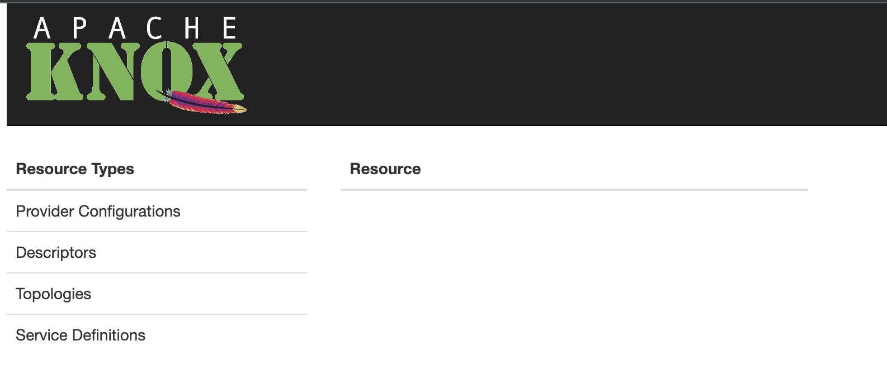

Selecting a resource type yields a listing of the existing resources of that type in the adjacent column, and selecting an individual resource
presents the details of that selected resource.

For the provider configuration, descriptor and service definition resources types, the 
icon next to the resource list header is the trigger for the respective facility for creating a new resource of that type. 
Modification options, including deletion, are available from the detail view for an individual resource.

##### Provider Configurations

The Admin UI lists the provider configurations currently deployed to Knox.

By choosing a particular provider configuration from the list, its details can be viewed and edited. 
The provider configuration can also be deleted (as long as there are no referencing descriptors).

By default, there is a provider configuration named __*default-providers*__.

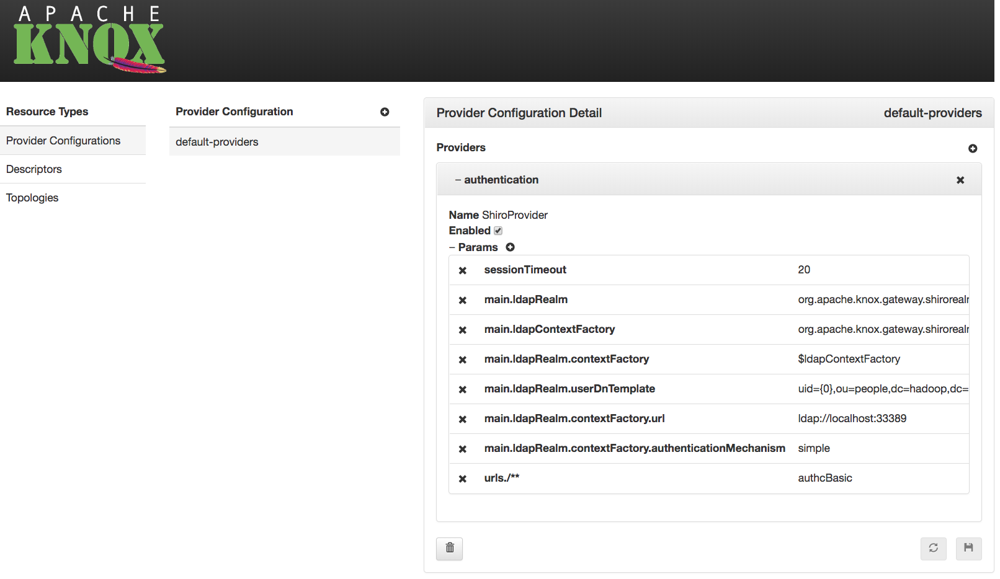

###### Editing Provider Configurations
For each provider in a given provider configuration, the attributes can be modified:

* The provider can be enabled/disabled
* Parameters can be added () or removed ()
* Parameter values can be modified (by clicking on the value)
  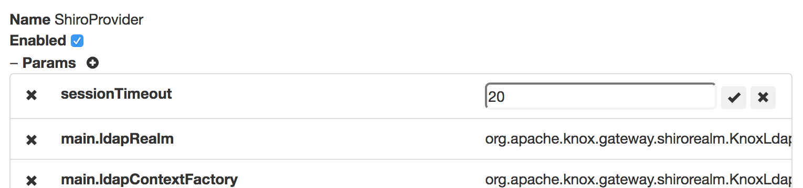

 
To persist changes, the 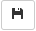 button must be clicked. To revert *unsaved* changes, click the  button or simply choose another resource.
 

###### Create Provider Configurations

The Admin UI provides the ability to define new provider configurations, which can subsequently be referenced by one or more descriptors.

These provider configurations can be created based on the functionality needed, rather than requiring intimate knowledge of the various provider names
and their respective parameter names.

A provider configuration is a named set of providers. The wizard allows an administrator to specify the name, and add providers to it.

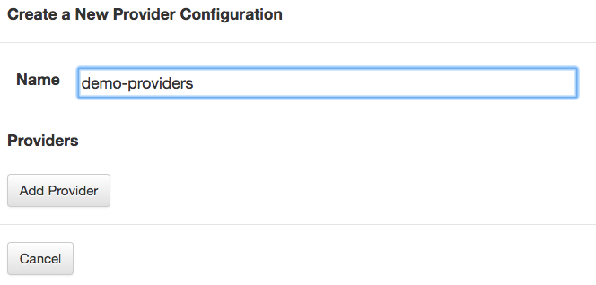

To add a provider, first a category must be chosen.

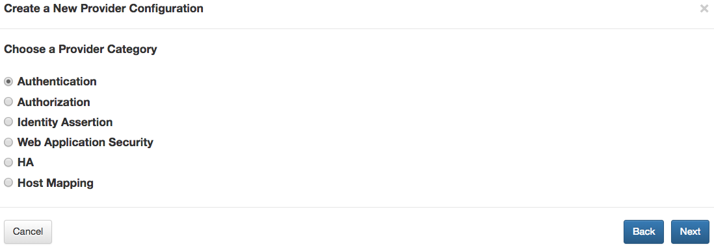

After choosing a category, the type within that category must be selected.

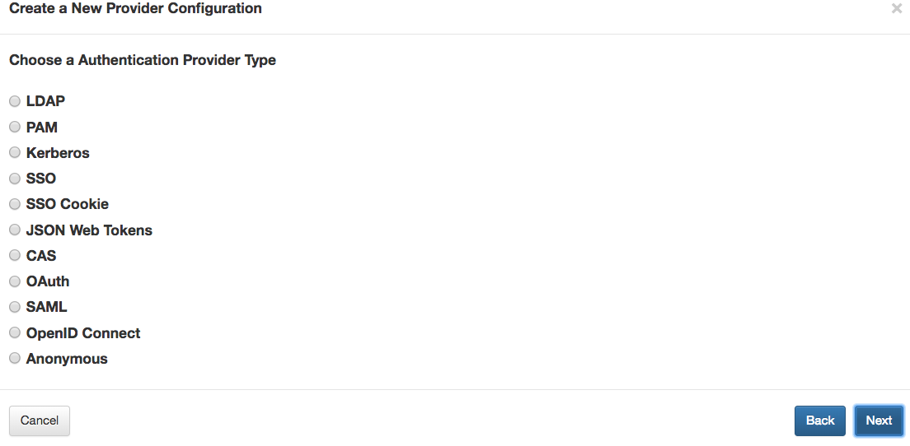

Finally, for the selected type, the type-specific parameter values can be specified.

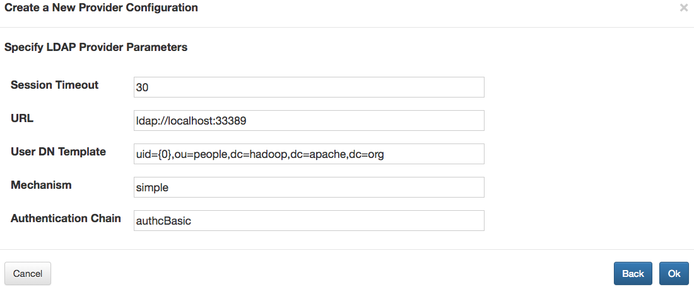

After adding a provider, others can be added similarly by way of the __Add Provider__ button.

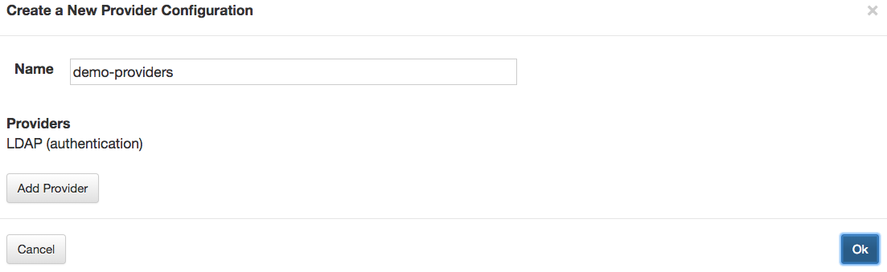

###### Composite Provider Types

The wizard for some provider types, such as the HA provider, behave a little differently than the other provider types.

For example, when you choose the HA provider category, you subsequently choose a service role (e.g., WEBHDFS), and specify the parameter values for that service role's entry in the HA provider.

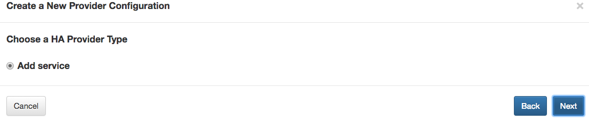

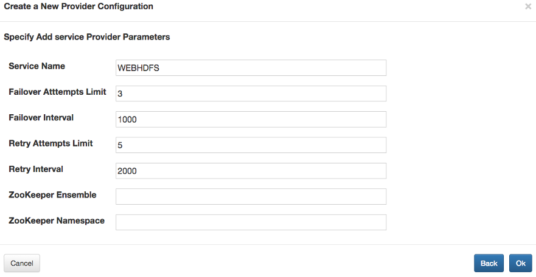

If multiple services are configured in this way, the result is still a single HA provider, which contains all of the service role configurations.

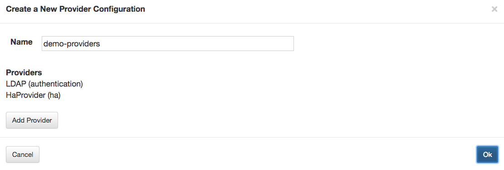

###### Persisting the New Provider Configuration

After adding all the desired providers to the new configuration, choosing 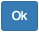 persists it.

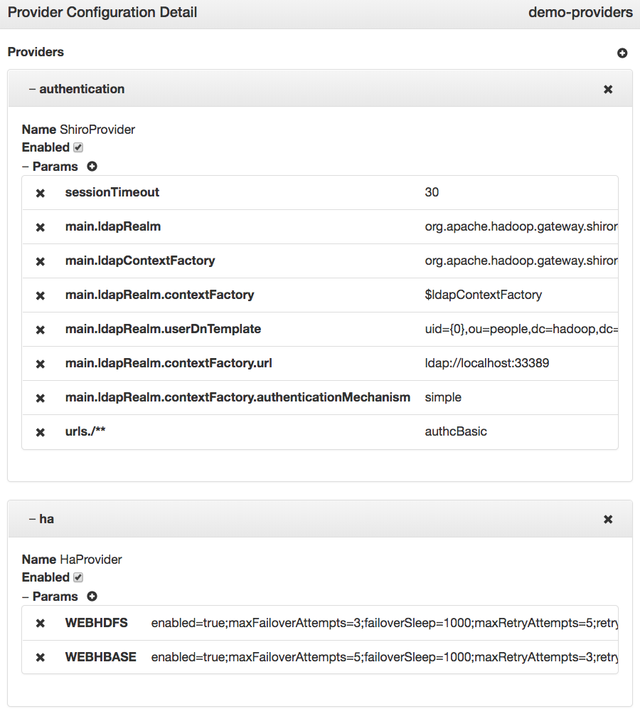

##### Descriptors

A descriptor is essentially a named set of service roles to be proxied with a provider configuration reference.
The Admin UI lists the descriptors currently deployed to Knox.

By choosing a particular descriptor from the list, its details can be viewed and edited. The provider configuration can also be deleted.

Modifications to descriptors will result in topology changes. When a descriptor is saved or deleted, the corresponding topology is \[re\]generated or deleted/undeployed respectively.

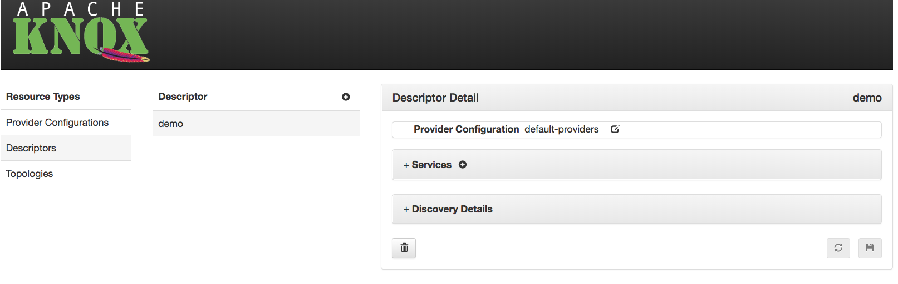

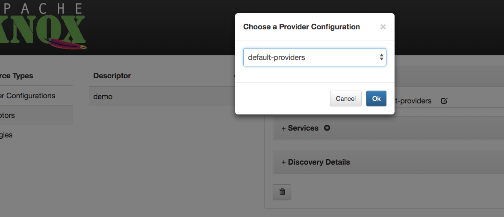

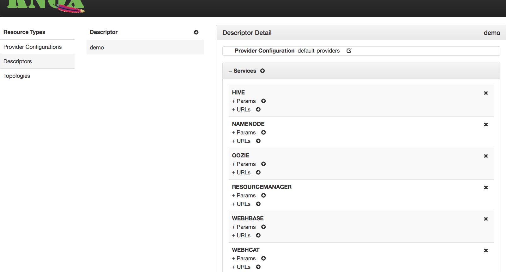

###### Create Descriptors

The Admin UI provides the ability to define new descriptors, which result in the generation and deployment of corresponding topologies.

The __new descriptor__ dialog provides the ability to specify the name, which will also be the name of the resulting topology. It also
allows one or more supported service roles to be selected for inclusion.

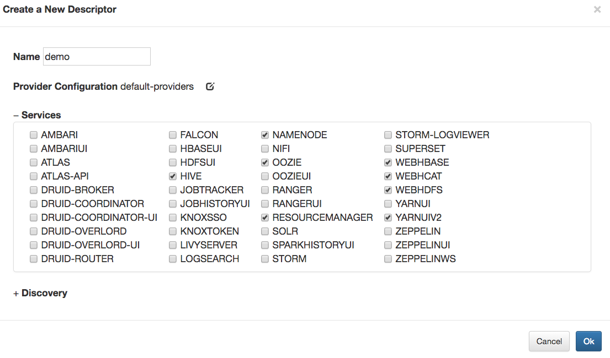

The provider configuration reference can entered manually, or the provider configuration selector can be used, to specify the name of an
existing provider configuration.

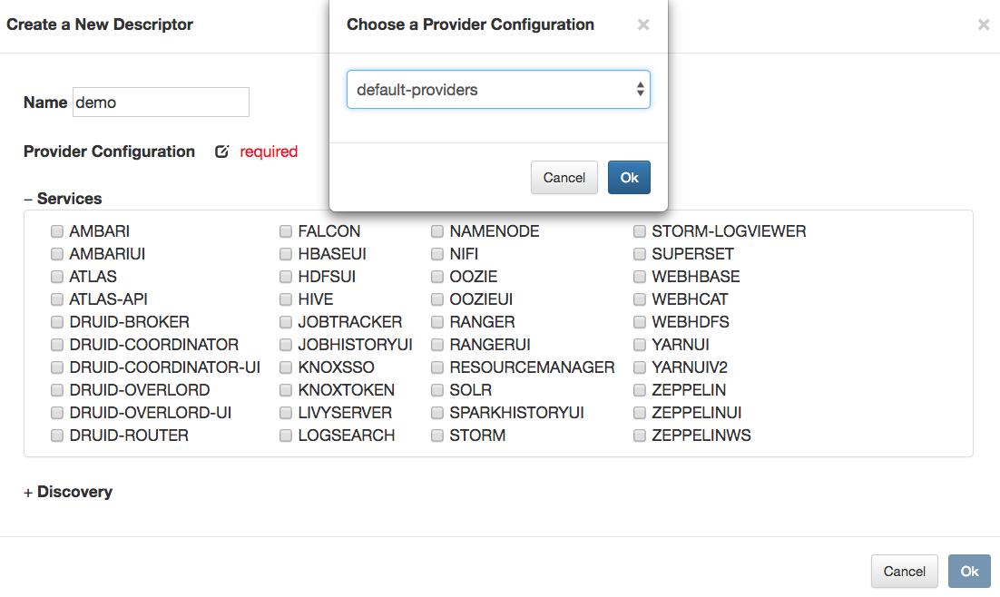

Optionally, discovery details can also be specified to direct Knox to discover the endpoints for the declared service roles from a supported discovery source for the
target cluster.

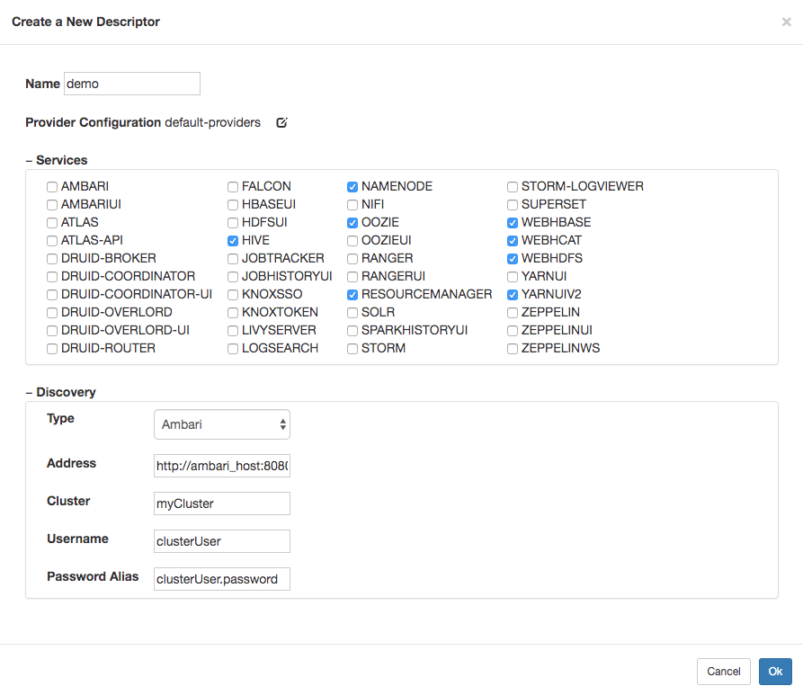

Choosing  results in the persistence of the descriptor, and subsequently, the generation and deployment of the associated topology.

###### Service Discovery

Descriptors are a means to *declaratively* specify which services should be proxied by a particular topology, allowing Knox to interrogate a discovery source
to determine the endpoint URLs for those declared services. The Service Discovery options tell Knox how to connect to the desired discovery source
to perform this endpoint discovery.

*Type*

This property specifies the type of discovery source for the cluster hosting the services whose endpoints are to be discovered.

*Address*

This property specifies the address of the discovery source managing the cluster hosting the services whose endpoints are to be discovered.

*Cluster*

This property specifies from which of the clusters, among those being managed by the specified discovery source, the service endpoints should be determined.

*Username*

This is the identity of the discovery source user (e.g., Ambari *Cluster User* role), which will be used to get service configuration details from the discovery source.

*Password Alias*

This is the Knox alias whose value is the password associated with the specified username.

This alias must have been defined prior to specifying it in a descriptor, or else the service discovery will fail for authentication reasons.

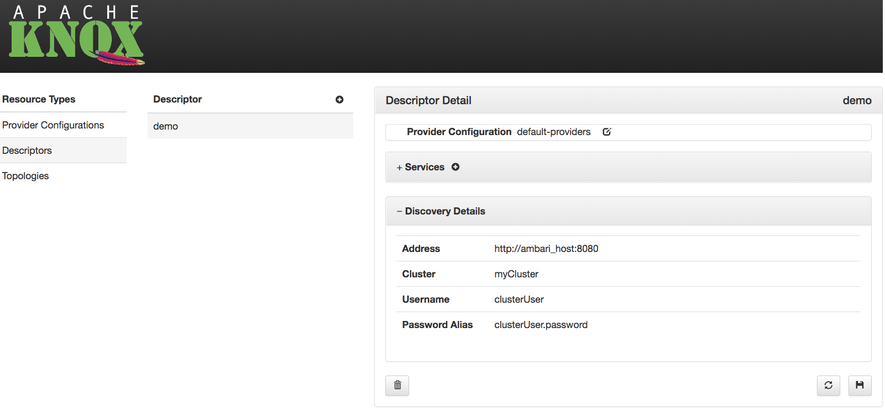

##### Topologies

The Admin UI allows an administrator to view, modify, duplicate and delete topologies which are currently deployed to the Knox instance.
Changes to a topology results in the [re]deployment of that topology, and deleting a topology results in its undeployment.

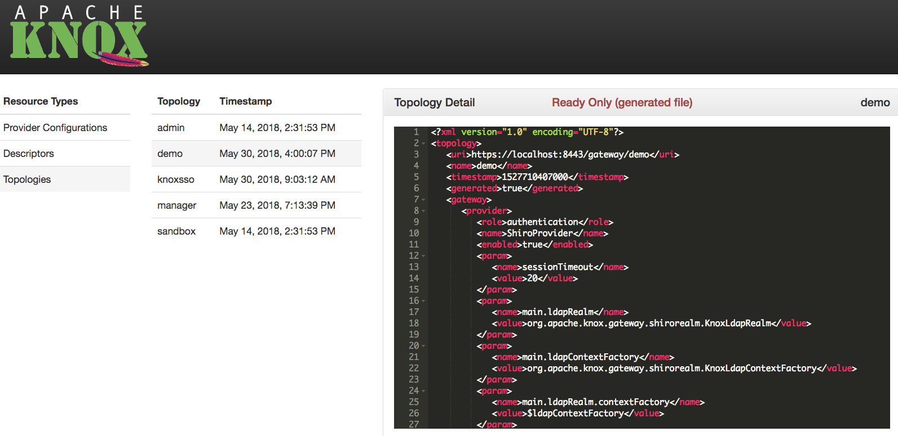

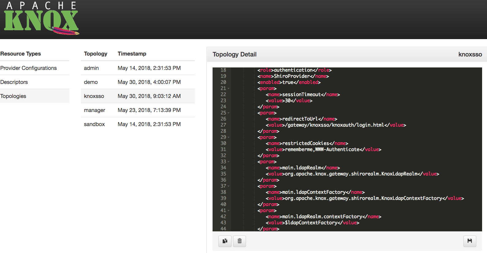

###### Read-Only Protections

Topologies which are generated from descriptors are treated as read-only in the Admin UI. This is to avoid the potential confusion resulting from an administrator directly editing
a generated topology only to have those changes overwritten by a regeneration of that same topology because the source descriptor or provider configuration changed.

##### Knox HA Considerations

If the Knox instance which is hosting the Admin UI is configured for [remote configuration monitoring](#remote-configuration-monitor), then provider configuration and descriptor changes will
be persisted in the configured ZooKeeper ensemble. Then, every Knox instance which is also configured to monitor configuration in this same ZooKeeper will apply
those changes, and [re]generate/[re]deploy the affected topologies. In this way, Knox HA deployments can be managed by making changes once, and from any of the
Knox instances.

##### Service Definitions

The Admin UI allows an administrator to view, modify, create and delete service definitions which are currently supported by Knox.

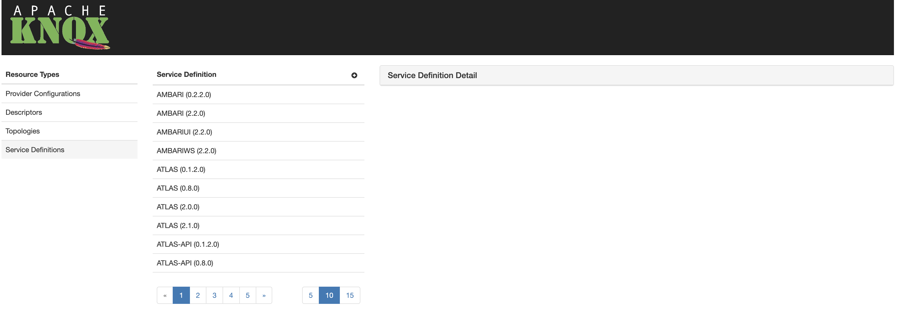

A service definition is a declarative way of plugging-in a new Service. It consists of two separate files as described in the relevant section in [Knox's Developer Guide](https://knox.apache.org/books/knox-2-0-0/dev-guide.html#Service+Definition+Files). The Admin UI lists the service definitions currently supported by Knox in a data table ordered by the service name. If a particular service has more than one service definition (for different versions), a separate service definition entry is displayed in the table. Under the table there is a pagination panel that let's end-users to navigate to the desired service definition.

By choosing a particular service definition from the table, its details can be viewed and edited. The service definition can also be deleted.

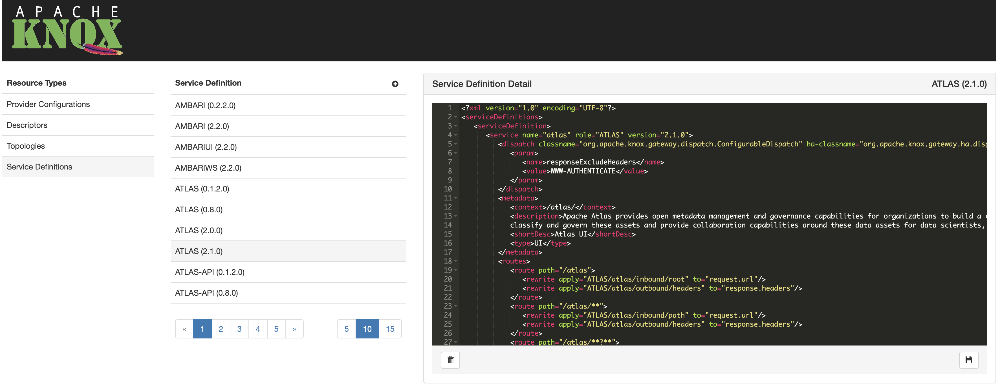

###### Editing Service Definitions

When a particular service definition is selected, the Admin UI displays a free-text area where the content can be updated and saved. End-users will see the following structure in this text area:

    <serviceDefinition>
    	<service>
        ...
	    </service>
	    <rules>
        ...
        </rules>
    </serviceDefinition>

Everything within the `<service>` section will be written into the given service's `service.xml` file whereas the content of `rules` are going into the `rewrite.xml`.

To persist changes, the  button must be clicked. To revert *unsaved* changes, simply choose another resource. In case you choose to save your changes, a confirmation window is shown asking for your approval, where you can make your changes final by clicking the 
 
 
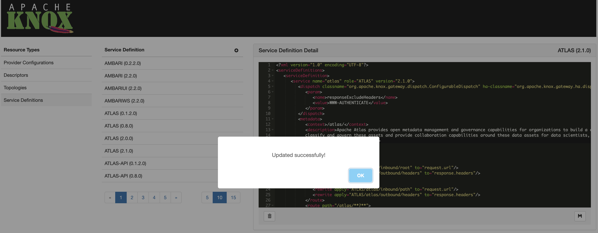

If you are unsure about the change you made, you can still click the `Cancel` button and select another resource to revert your unsaved change.

**Important note:** editing a service definition will result in redeploying all topologies that include the updated service (identified by it's name and, optionally, version).

###### Deleting Service Definitions

Similarly to the service definition editing function, end-users have to select the service defintion first they are about to remove.

The service definition details are displayed along with the 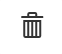 button in the bottom-left corner of the service definition details window. To remove the selected service definition, you have to cick that button and you will be shown a confirmation window where you can verify the service definition removal by clicking the  button.

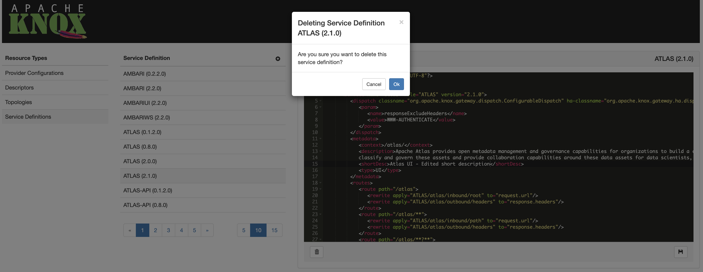
 
 
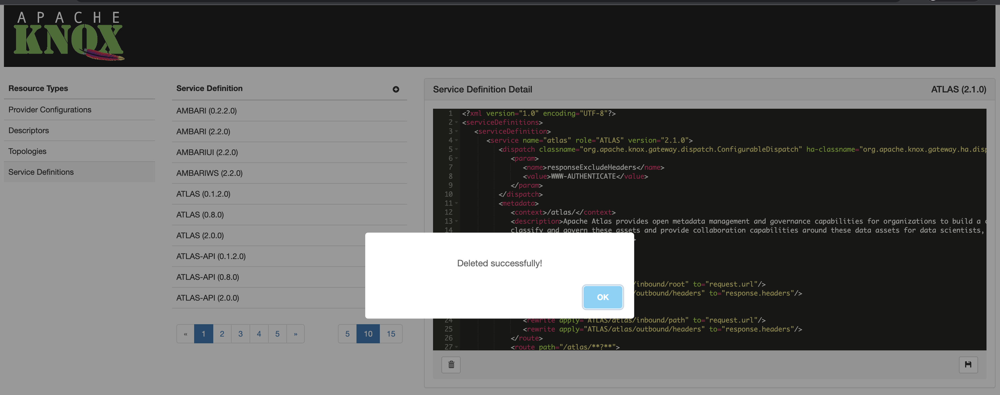

**Important note:** deleting a service definition will result in redeploying all topologies that included the removed service (identified by it's name and, optionally, version).

###### Creating Service Definitions

The Admin UI provides the ability to define new service definitions which can be included in topologies later on.

The new service definition dialog provides the ability to specify the service name, role and version as well as all the required information in `service.xml` and `rewrite.xml` files such as routes and rewrite rules.

To create a new service provider, please click the  button after you selected `Service Definitions` from the `Resource Types` list.

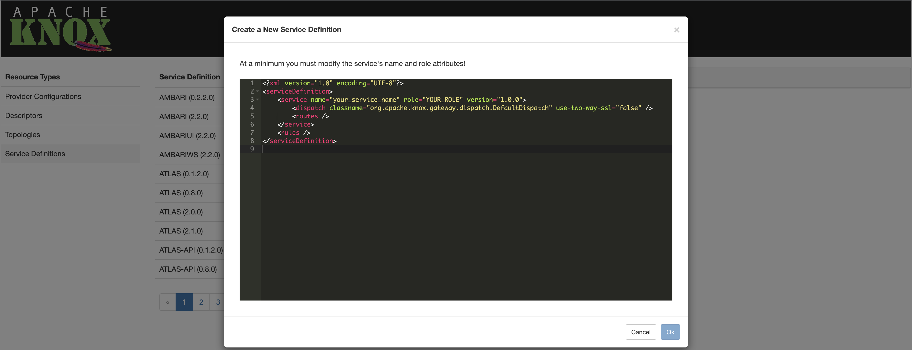

After defining all details, you have to click the  button to save the newly created service definition on the disk.

 You may want to copy-paste a valid service definition before you open the new service definition dialog and self-tailor the content for your needs.

 

