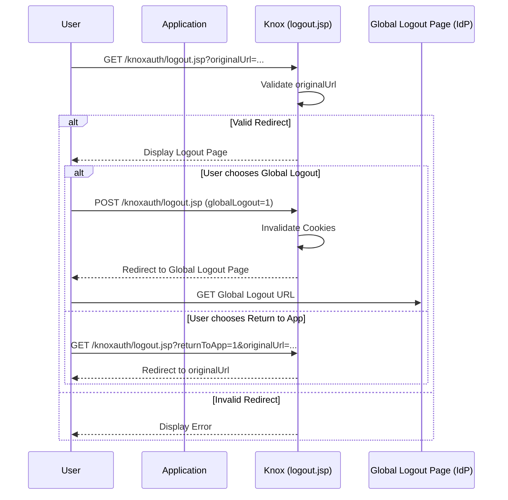

# KnoxSSO Logout

Apache Knox provides multiple ways to handle session logout, ranging from user-facing pages to programmatic REST endpoints.

## User-Facing Logout (logout.jsp)

The primary logout mechanism for end-users is managed by `logout.jsp` within the `knoxauth` application. It provides a UI to terminate sessions and redirect users.

### Logout Flow Overview

The logout process can be triggered by navigating to the `logout.jsp` endpoint. The behavior of this page is controlled by several query parameters.

#### Query Parameters

| Parameter | Description |
|-----------|-------------|
| `originalUrl` | The URL to which the user should be redirected after logout. This URL must be whitelisted. |
| `returnToApp` | If set to `1`, and `originalUrl` is valid, the user is immediately redirected to the `originalUrl`. |
| `globalLogout` | If set to `1`, the KnoxSSO session cookie and associated pac4j cookies are removed, and the user is redirected to the configured global logout page. |
| `autoGlobalLogout`| If set to `1`, the page will automatically trigger the global logout process upon loading. |

#### Process Details

1. **Validation**:
   The `originalUrl` (if provided) is validated against the configured whitelist (`knoxsso.redirect.whitelist.regex`). If validation fails, a security warning is displayed.

2. **Session Termination (Global Logout)**:
   When a global logout is initiated:
    * The SSO cookie (default `hadoop-jwt`) is invalidated by setting its `Max-Age` to 0.
    * Various `pac4j` session cookies are removed.
    * The user is redirected to the `knox.global.logout.page.url` configured in `gateway-site.xml`.

3. **Return to Application**:
   If `returnToApp=1` is provided, Knox redirects the user back to the `originalUrl`. Note: this does not invalidate the SSO session; if the cookie is still valid, the user may be automatically logged back in.

## Programmatic Logout (KNOXSSOUT Service)

For applications that need to trigger a logout programmatically (e.g., via AJAX/XHR) or require server-side state cleanup, Knox provides the `KNOXSSOUT` service, implemented by `WebSSOutResource`.

### Endpoint

`GET/POST /<gateway-path>/<topology>/knoxssout/api/v1/webssout`

### Key Responsibilities

* **Browser Cookie Removal**: It explicitly clears the SSO cookie (e.g., `hadoop-jwt`) by returning a `Set-Cookie` header with `Max-Age=0` and the appropriate domain/path.
* **Server-Side Token Revocation**: If the Knox `TokenStateService` is enabled (`knox.token.exp.server-managed=true`), this service will actively revoke the JWT token. This prevents the token from being used in subsequent requests even if the browser fails to clear the cookie.
* **Concurrent Session Management**: It interacts with the `ConcurrentSessionVerifier` to ensure that the user's active session count is correctly decremented upon logout.
* **Response Format**: Returns a JSON object:
  ```json
  { "loggedOut" : true }
  ```

## Logout Types

Knox distinguishes between terminating the local Knox session and the broader global SSO session.

### Knox Application Logout (Local)
This terminates the session within the Knox Gateway.
* **Action**: The `hadoop-jwt` cookie is removed, and the token is revoked (if server-managed state is enabled).
* **Result**: The user is logged out of Knox, but their session at the **Identity Provider (IdP)** remains active.
* **Trigger**: Calling the `KNOXSSOUT` service or visiting `logout.jsp` without the `globalLogout` parameter.

### Global Logout (Federated)
This terminates the session both in Knox and at the external Identity Provider.
* **Action**: Knox clears the local cookies/tokens and then redirects the browser to the **Global Logout Page URL**.
* **Result**: The user is logged out of Knox and the central IdP (e.g., SAML, OIDC). They must re-authenticate at the IdP to access any SSO-protected resource.
* **Trigger**: Clicking the "Global Logout" button on `logout.jsp` or passing `globalLogout=1`.
* **Requirement**: Requires `knox.global.logout.page.url` to be configured in `gateway-site.xml`.

## Comparison: logout.jsp vs WebSSOutResource

| Feature | logout.jsp | WebSSOutResource |
|---------|------------|------------------|
| **Target Audience** | End-users (Browser) | Applications (REST API) |
| **Response** | HTML/UI | JSON/XML |
| **Global Logout** | Supported (via redirect) | Not directly (Cookie/Token only) |
| **Token Revocation**| Indirect (via Global Logout) | Direct (via TokenStateService) |
| **Use Case** | Redirecting after logout | Background session cleanup |
## Configuration

The logout flow parameters are typically defined in the topology file. Note that while `WebSSOutResource` belongs to the **KNOXSSOUT** service, the `logout.jsp` UI specifically searches the topology for the **KNOXSSO** service to retrieve its configuration.

### Topology Configuration (KNOXSSO / KNOXSSOUT)

| Parameter | Description | Default |
|-----------|-------------|---------|
| `knoxsso.cookie.name` | The name of the SSO cookie to be cleared. | `hadoop-jwt` |
| `knoxsso.redirect.whitelist.regex` | Whitelist for `originalUrl` redirection. | None |

> **Note**: For the `logout.jsp` UI to find these parameters, they should be defined under the `KNOXSSO` service role in your topology. The `KNOXSSOUT` service also uses `knoxsso.cookie.name` to identify which cookie to invalidate programmatically.

### Gateway Configuration (gateway-site.xml)

| Property | Description | Default |
|----------|-------------|---------|
| `knox.global.logout.page.url` | URL of the global logout page (e.g., IdP logout). | None |
| `knox.homepage.logout.enabled` | Enables logout from the Knox home page. | `false` |

## Sequence Diagram (logout.jsp)



