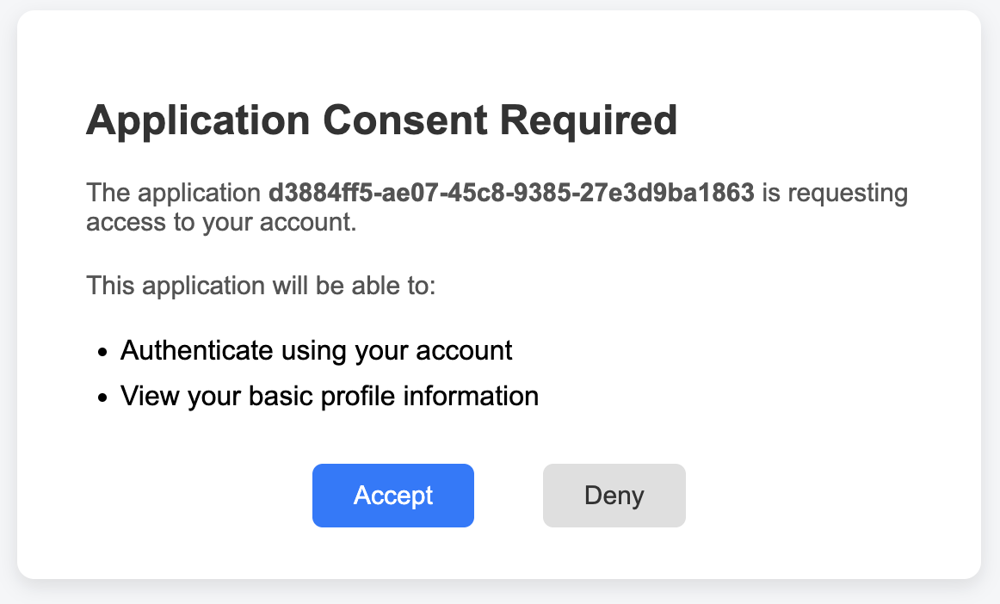

<!--
   Licensed to the Apache Software Foundation (ASF) under one or more
   contributor license agreements.  See the NOTICE file distributed with
   this work for additional information regarding copyright ownership.
   The ASF licenses this file to You under the Apache License, Version 2.0
   (the "License"); you may not use this file except in compliance with
   the License.  You may obtain a copy of the License at

       https://www.apache.org/licenses/LICENSE-2.0

   Unless required by applicable law or agreed to in writing, software
   distributed under the License is distributed on an "AS IS" BASIS,
   WITHOUT WARRANTIES OR CONDITIONS OF ANY KIND, either express or implied.
   See the License for the specific language governing permissions and
   limitations under the License.
-->

# Endpoint Reference

KnoxIDF exposes a set of REST endpoints aligned with the standard OpenID Connect expectations,
so clients configured for a Keycloak-like provider work against Knox with minimal changes.

## Base path and URL structure

All KnoxIDF endpoints share the base path `knoxidf/api/v1`. As with every Knox service, the
gateway prefixes the topology name, so a fully-qualified URL looks like:

```
https://{knox-host}:8443/gateway/{topology}/knoxidf/api/v1/{endpoint}
```

The administrative endpoints (service role `KNOXIDF_ADMIN`) live under a separate base path,
`knoxidf/admin/v1`.

!!! tip "Always read endpoint URLs from discovery"
    Do not hard-code endpoint paths in clients. Fetch the
    [discovery document](#discovery-endpoint) and use the URLs it advertises. When a
    `token.exchange.topology.name` is configured, the `token_endpoint` and `userinfo_endpoint`
    are deliberately rewritten to point at the token-exchange topology — discovery reflects
    that, hard-coded paths will not.

## Endpoint summary

| Endpoint | Path | Methods | Role |
|----------|------|---------|------|
| [Discovery](#discovery-endpoint) | `knoxidf/api/v1/.well-known/openid-configuration` | GET | `KNOXIDF` |
| [Authorization](#authorization-endpoint) | `knoxidf/api/v1/authorize` | GET, POST | `KNOXIDF` |
| [Federated callback](#federated-callback) | `knoxidf/api/v1/authorize/callback` | GET | `KNOXIDF` |
| [Token](#token-endpoint) | `knoxidf/api/v1/token` | POST | `KNOXIDF` |
| [UserInfo](#userinfo-endpoint) | `knoxidf/api/v1/userinfo` | GET | `KNOXIDF` |
| [JWKS](#jwks-endpoint) | `knoxidf/api/v1/jwks` | GET | `KNOXIDF` |
| [Client Registration](#client-registration-endpoint) | `knoxidf/api/v1/client/register` | POST | `KNOXIDF` |
| [Consent page](#consent-page) | `authConsent` | GET | `KNOXIDF` |
| [Consent decision](#consent-page) | `knoxidf/api/v1/authorize/consentAccepted`, `…/consentDenied` | POST | `KNOXIDF` |
| [Trusted OIDC Issuers (admin)](#trusted-oidc-issuers-admin) | `knoxidf/admin/v1/trusted-oidc-issuers` | GET, POST, DELETE | `KNOXIDF_ADMIN` |
| [Delegation Policies (admin)](#delegation-policies-admin) | `knoxidf/admin/v1/delegation-policies` | GET, POST, PUT, DELETE | `KNOXIDF_ADMIN` |

---

## Discovery endpoint

`GET /knoxidf/api/v1/.well-known/openid-configuration`

Returns the OpenID Connect Discovery document. All endpoint URLs are built dynamically from the
request's base URI, so the document is always correct for the topology it is served from.

Example document:

```json
{
  "issuer": "https://knox:8443/gateway/knoxidf-ldap/knoxidf",
  "authorization_endpoint": "https://knox:8443/gateway/knoxidf-ldap/knoxidf/api/v1/authorize",
  "token_endpoint": "https://knox:8443/gateway/knoxidf-token/knoxidf/api/v1/token",
  "userinfo_endpoint": "https://knox:8443/gateway/knoxidf-token/knoxidf/api/v1/userinfo",
  "registration_endpoint": "https://knox:8443/gateway/knoxidf-ldap/knoxidf/api/v1/client",
  "jwks_uri": "https://knox:8443/gateway/knoxidf-ldap/knoxidf/api/v1/jwks",
  "response_types_supported": ["code"],
  "subject_types_supported": ["public"],
  "token_endpoint_auth_methods_supported": ["client_secret_post", "none"],
  "client_id_metadata_document_supported": false,
  "grant_types_supported": ["authorization_code", "refresh_token"],
  "scopes_supported": ["openid", "profile", "email", "offline_access"],
  "id_token_signing_alg_values_supported": ["RS256"],
  "code_challenge_methods_supported": ["S256"]
}
```

Notable metadata:

- **`subject_types_supported: ["public"]`** — Knox derives a shared (non-pairwise) `sub`, the
  same value for every client.
- **`token_endpoint_auth_methods_supported: ["client_secret_post", "none"]`** — the token
  endpoint reads client credentials only from the request body (`client_secret_post`);
  public clients use PKCE with no secret (`none`). HTTP Basic (`client_secret_basic`) is
  intentionally **not** advertised because it is not honored.
- **`code_challenge_methods_supported: ["S256"]`** — only S256 PKCE is accepted; `plain` is
  rejected.
- **`client_id_metadata_document_supported: false`** — Knox does not resolve a URL-style
  `client_id` as a Client ID Metadata Document (OAuth CIMD draft, referenced by the MCP
  authorization spec); clients must use dynamic registration instead.

---

## Authorization endpoint

`GET|POST /knoxidf/api/v1/authorize`

Begins the Authorization Code flow. Validates the request, checks (or collects) user consent,
and redirects back to the client `redirect_uri` with an authorization `code` and the echoed
`state`. If consent has not yet been granted for this (user, client, scopes), the browser is
first redirected to the [consent page](#consent-page).

Request parameters:

| Parameter | Required | Description |
|-----------|----------|-------------|
| `response_type` | Yes | `code`, `id_token`, or `code id_token`. |
| `client_id` | Yes | A registered client identifier. |
| `redirect_uri` | Yes | Must match the client's registered `redirect_uris`. |
| `scope` | No | Space-delimited scopes. Defaults to `openid profile email offline_access`. |
| `state` | No | Opaque CSRF value, echoed back in the redirect. |
| `nonce` | No | Bound to the issued ID token. |
| `code_challenge` | No (PKCE) | Base64url S256 hash of the `code_verifier`. |
| `code_challenge_method` | Required if `code_challenge` present | Must be `S256`; `plain` is rejected. |

**Success:** `302` redirect to `{redirect_uri}?code={auth_code}&state={state}`.

**Errors:** a JSON body `{"error": "...", "error_description": "..."}` — `invalid_request`
(unknown `client_id`, bad `redirect_uri`, missing parameters, unsupported PKCE method) or
`invalid_scope` (a requested scope is not in the client's allowed scopes). When consent is
required, a `303` redirect to the consent page.

### Federated callback

`GET /knoxidf/api/v1/authorize/callback`

Back-channel callback invoked by an external OIDC Provider during [federation](federation.md).
Exchanges the OP authorization `code` for the OP's tokens, **validates the OP `id_token`**
(signature via JWKS, issuer, audience, nonce, and `sub` presence), resolves or persists the
federated identity, then issues a Knox authorization code and redirects to the original client
`redirect_uri`.

| Parameter | Required | Description |
|-----------|----------|-------------|
| `code` | Yes | Authorization code from the federated OP. |
| `state` | Yes | Must match a live entry in the authorize-request store. |

This endpoint must be reachable without prior Knox authentication (wired as `anon`, or listed
in `sso.unauthenticated.path.list`).

---

## Token endpoint

`POST /knoxidf/api/v1/token` &nbsp; `Content-Type: application/x-www-form-urlencoded`

Issues tokens. Supports the **Client Credentials**, **Authorization Code**, **Refresh
Token**, and [**Token Exchange**](#token-exchange-grant) (RFC 8693) grants. Client authentication
is enforced here — see [Security](security.md#token-endpoint-client-authentication).

### Authorization Code grant

Redeems a one-time authorization code. The code is atomically consumed (single-use); a public
client proves possession via PKCE `code_verifier`, a confidential client via `client_secret`.

| Parameter | Required | Description |
|-----------|----------|-------------|
| `grant_type` | Yes | `authorization_code`. |
| `code` | Yes | The authorization code from `/authorize`. |
| `redirect_uri` | Yes | Must match the URI stored with the code. |
| `client_id` | Yes | Must match the client that obtained the code. |
| `client_secret` | Conditional | Required when no `code_challenge` was stored. |
| `code_verifier` | Conditional | Required when a `code_challenge` was stored at authorize time. |

### Refresh Token grant

Rotates a refresh token: atomically consumes the presented token and issues a new
access-token / refresh-token pair. Requires `client_secret`.

| Parameter | Required | Description |
|-----------|----------|-------------|
| `grant_type` | Yes | `refresh_token`. |
| `refresh_token` | Yes | A previously issued refresh token. |
| `client_id` | Yes | Must match the client bound to the refresh token. |
| `client_secret` | Yes | Client secret. |

**Success (`200`):**

```json
{
  "access_token": "<JWT>",
  "token_id": "<UUID>",
  "token_type": "Bearer",
  "expires_in": 86400,
  "managed_token": "true",
  "id_token": "<JWT>",
  "refresh_token": "<JWT>",
  "passcode": "<Base64(tokenId)::Base64(passcode)>"
}
```

`refresh_token` is present only when the scope includes `offline_access`. The `id_token`
carries `sub`, `iss`, `aud` (= `client_id`), `exp`, `iat`, and `nonce` (when supplied); for
federated users it additionally carries `federated_idp`, `federated_sub`, and `federated_iss`
plus any allowed profile claims (`preferred_username`, `email`, `email_verified`,
`given_name`, `family_name`, `name`, `locale`).

**Errors:** `invalid_grant` (missing/expired/replayed code, `redirect_uri` or `client_id`
mismatch, PKCE failure, bad `client_secret`, disabled/expired refresh token) or
`invalid_request` (unsupported `grant_type`).

### Token Exchange grant

Trades one JWT for another under [RFC 8693](https://www.rfc-editor.org/rfc/rfc8693) — either for
the same subject (e.g. to narrow a token's audience) or, when delegation is enabled, for a
different subject on whose behalf a trusted actor acts. The concepts, switches, and delegation-policy
model are covered on the [Token Exchange & Delegation](token_exchange.md) page; this section is the
wire-level reference.

| Parameter | Required | Description |
|-----------|----------|-------------|
| `grant_type` | Yes | `urn:ietf:params:oauth:grant-type:token-exchange`. |
| `subject_token` | Yes | The token whose subject the exchange is for. |
| `subject_token_type` | Yes | `urn:ietf:params:oauth:token-type:jwt` or its alias `urn:ietf:params:oauth:token-type:access_token`; any other type → `invalid_request`. |
| `actor_token` | No | Token of the acting party in an on-behalf-of exchange. |
| `actor_token_type` | Conditional | Required when `actor_token` is present, and must be absent otherwise. Same JWT-family types. |
| `requested_subject` | No | Subject to impersonate in a headless exchange. Read only when `delegation.requested.subject.enabled=true`. |
| `resource` | No | Target service URI(s), RFC 8707. Absolute URI, no fragment, else `invalid_target`. Repeatable / comma-splittable. |
| `audience` | No | Logical target audience(s). Repeatable / comma-splittable. |

**Success (`200`):** the standard token response, extended with the RFC 8693 `issued_token_type`:

```json
{
  "access_token": "<JWT>",
  "token_id": "<UUID>",
  "token_type": "Bearer",
  "issued_token_type": "urn:ietf:params:oauth:token-type:jwt",
  "expires_in": 86400,
  "managed_token": "true"
}
```

`expires_in` is a **relative lifetime in seconds** (RFC 6749 §5.1), and is omitted entirely for a
non-expiring token.

**Errors:** `invalid_request` (unsupported token type, `actor_token`/`actor_token_type` mismatch,
malformed `requested_subject`, delegation disabled, or a policy denial — the specific reason is
audited, not returned), `invalid_target` (bad `resource` URI, or a requested audience not authorized
for the subject), `401 invalid_request` (unregistered issuer or expired external token), and
`500 server_error` (LDAP unavailable while evaluating a group-based policy).

---

## UserInfo endpoint

`GET /knoxidf/api/v1/userinfo`

Returns OIDC UserInfo claims for a valid bearer access token. The upstream `JWTProvider`
validates the token and hands the token identity to this resource; the endpoint never reads the
raw `Authorization` header itself. For a federated user it returns the internal Knox `sub`, the
`idp` name, `federated_sub`, `federated_iss`, and any allowed profile claims; for a local user
it returns whatever the configured [user-parameter provider](configuration.md#user-parameters-and-claims)
resolves.

**Errors:** `invalid_request` when no token identity is present; `401` with
`WWW-Authenticate: Bearer error="invalid_token"` for an expired, revoked, or unknown token.

---

## JWKS endpoint

`GET /knoxidf/api/v1/jwks`

Publishes the gateway's public signing key(s) as a JWK Set so clients and resource servers can
verify KnoxIDF-issued JWTs. One JWK is published per configured signing-key alias, each keyed by
the SHA-256 thumbprint of its public key as the `kid`. This is what makes signing-key rotation
transparent to verifiers — see [Operations → Signing-key rotation](operations.md#signing-key-rotation).

```json
{
  "keys": [
    { "kty": "RSA", "use": "sig", "alg": "RS256", "kid": "<sha-256 thumbprint>", "n": "...", "e": "AQAB" }
  ]
}
```

---

## Client Registration endpoint

`POST /knoxidf/api/v1/client/register` &nbsp; `Content-Type: application/x-www-form-urlencoded`

Dynamically registers an OAuth2 client and returns a `client_id` and `client_secret`. Redirect
URIs must use HTTPS (plain HTTP is allowed only for loopback hosts, per RFC 8252). Anonymous
registration is **refused by default** and only permitted when
`knoxidf.client.registration.anonymous.allowed=true` is set on the topology — see
[Security](security.md#dynamic-client-registration).

| Parameter | Required | Description |
|-----------|----------|-------------|
| `redirect_uris` | Yes | Comma-separated. HTTPS required (loopback HTTP allowed); a wildcard `*` is only permitted at the end of the path, never in the host. |
| `allowed_scopes` | No | Comma-separated; must include `openid`. Defaults to `openid,profile,email,offline_access`. |

**Success (`200`):** returns `token_id` (the `client_id`), `passcode` (the `client_secret` to
use on `/token`), and the stored `redirect_uris` and `allowed_scopes`.

**Errors:** `access_denied` (anonymous caller when disabled), `invalid_request` (missing/invalid
`redirect_uris`, wrong scheme), `invalid_scope` (`allowed_scopes` omits `openid`).

!!! note "Use `/client/register`, not the bare `/client` path"
    Registration is served **only** by `POST /knoxidf/api/v1/client/register`. Although the discovery
    document's `registration_endpoint` points at the bare `knoxidf/api/v1/client` path, a plain `GET`
    or `POST` to that path is not implemented and returns `500`. Always post registrations to the
    `/register` sub-path.

---

## Consent page

`GET /{topology}/authConsent`

An HTML consent page (a lightweight servlet, registered only when the topology includes the
`KNOXIDF` service). `GET` renders the requesting `client_id` and a human-readable description of
each requested scope with **Accept** / **Deny** buttons.

The decision is submitted with an HTTP **POST** — the **Accept** and **Deny** buttons post the
form directly to `authorize/consentAccepted` and `authorize/consentDenied` respectively. Both
endpoints are **POST-only**, so accepting consent (which persists a consent record and issues an
authorization code) can never be triggered by passive `GET` navigation such as link prefetch,
history re-navigation, or a leaked consent-URL. `consentAccepted` also verifies that the
authenticated user matches the subject that initiated the authorization request, rejecting a
replayed consent form from a different user with `403`; `consentDenied` returns `403`. Consent is
one-time per (user, client, scopes) — see [Security → Consent](security.md#consent).



---

## Trusted OIDC Issuers (admin)

Base path `knoxidf/admin/v1/trusted-oidc-issuers`, served by the `KNOXIDF_ADMIN` service role
(a separate, administrator-only topology). Manages the set of external issuers whose `id_token`s
Knox will accept during federated login.

| Method | Path | Purpose | Success |
|--------|------|---------|---------|
| `POST` | `/trusted-oidc-issuers` | Register a trusted issuer (JSON body: `issuerUrl` (HTTPS, required), `dynamicJwks`, `clusterName`). | `201` |
| `GET` | `/trusted-oidc-issuers` | List registered issuers (with `registeredAt` / `registeredBy`). | `200` |
| `DELETE` | `/trusted-oidc-issuers?issuerUrl=...` | Deregister an issuer (idempotent). | `204` |
| `POST` | `/trusted-oidc-issuers/refresh-jwks?issuerUrl=...` | Force a JWKS cache refresh for a `dynamicJwks` issuer. | `204` |

**Errors:** `400 invalid_request` (missing/non-HTTPS `issuerUrl`, malformed JSON),
`409 issuer_exists`, `409 issuer_limit_reached` (issuer cap), `500 storage_error`.

---

## Delegation Policies (admin)

Base path `knoxidf/admin/v1/delegation-policies`, served by the `KNOXIDF_ADMIN` service role
(a separate, administrator-only topology). Manages the [delegation policies](token_exchange.md#delegation-policies)
that authorize an actor to act on behalf of other subjects during a
[delegated token exchange](token_exchange.md#delegated-exchange).

| Method | Path | Purpose | Success |
|--------|------|---------|---------|
| `POST` | `/delegation-policies` | Register a new policy (fails if the actor already has one). | `201` |
| `PUT` | `/delegation-policies` | Register-or-update by actor identity: create, or replace the existing policy for the same `(actorAuthority, actorId)`. | `201` created / `200` replaced |
| `GET` | `/delegation-policies` | List policies; optional `?actorAuthority=` filter. Response carries a `hasMore` flag. | `200` |
| `GET` | `/delegation-policies/{registrationId}` | Read one policy. | `200` |
| `PUT` | `/delegation-policies/{registrationId}` | Full replace of one policy by id (`actorAuthority`/`actorId` are immutable). | `200` |
| `DELETE` | `/delegation-policies/{registrationId}` | Delete a policy (id must exist). | `204` |

**Request body** (`POST`/`PUT`, `Content-Type: application/json`):

```json
{
  "actorAuthority": "USER",
  "actorId": "svc-etl",
  "name": "ETL batch delegation",
  "description": "Lets the ETL service act for analysts",
  "status": "active",
  "canActForUsers": ["analyst1", "analyst2"],
  "canActForGroups": ["analysts"],
  "allowHeadlessExchange": true,
  "tokenTtlSec": 3600,
  "resourcePolicy": { "https://data.example.com": ["read"] }
}
```

`actorAuthority` and `actorId` are required; at least one of `canActForUsers` / `canActForGroups`
must be non-empty; `status` defaults to `active` and must be `active` or `revoked`; `tokenTtlSec`,
when supplied, must fall within `[knox.delegation.min.token.ttl.sec, knox.delegation.max.token.ttl.sec]`
(defaults 60–86400). The response echoes the stored policy plus the generated `registrationId` and
`createdBy` / `createdAt` / `updatedAt` audit fields.

!!! note "`hasMore` is a capacity flag, not a pagination cursor"
    The list response's `hasMore` signals that the configured listing cap
    (`gateway.delegation.service.list.max.total` / `.list.max.per.authority`) was reached and some
    policies were not returned. There is no continuation token — narrow the result with
    `?actorAuthority=` or raise the cap.

**Errors:** `400 invalid_request` (malformed JSON, missing `actorAuthority`/`actorId`, empty
act-for sets, out-of-range `tokenTtlSec`, bad `status`), `404 policy_not_found` (unknown
`registrationId`, or an id whose `actorAuthority`/`actorId` does not match on `PUT /{id}`),
`409 actor_exists` (`POST` for an actor that already has a policy), `500 storage_error`.
