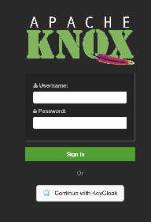
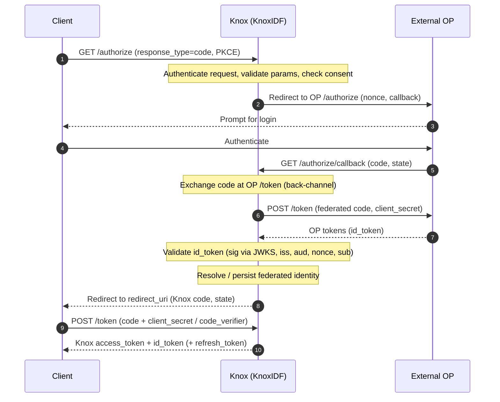

<!--
   Licensed to the Apache Software Foundation (ASF) under one or more
   contributor license agreements.  See the NOTICE file distributed with
   this work for additional information regarding copyright ownership.
   The ASF licenses this file to You under the Apache License, Version 2.0
   (the "License"); you may not use this file except in compliance with
   the License.  You may obtain a copy of the License at

       https://www.apache.org/licenses/LICENSE-2.0

   Unless required by applicable law or agreed to in writing, software
   distributed under the License is distributed on an "AS IS" BASIS,
   WITHOUT WARRANTIES OR CONDITIONS OF ANY KIND, either express or implied.
   See the License for the specific language governing permissions and
   limitations under the License.
-->

# Federation

In addition to being a standalone OIDC Provider, KnoxIDF can **broker** login to one or more
external OpenID Providers (OPs) — Keycloak, Okta, Azure AD, Auth0, and so on. In this mode Knox
delegates the actual authentication to the external OP, validates the identity it returns, and
then re-issues **its own Knox-signed tokens** to the client. Downstream services still only need
to trust Knox, regardless of where the user actually authenticated.

Federation is entirely optional and configured per topology. A topology with no
`federated.op.names` behaves as a pure Knox OP.

## The login experience

When a topology fronts `/authorize` with an SSO cookie provider and has one or more federated
OPs enabled, the Knox login page offers the external OP as an alternative to Knox's own
authentication providers (LDAP, PAM, SAML, Kerberos, …):



The end user chooses whether to sign in with a Knox-native provider or to identify themselves
through the external OIDC Provider.

## Broker flow

Federation is implemented as a token-brokering mechanism:



Step by step:

1. **Client initiates.** The OIDC client calls `/authorize`. The topology's provider
   authenticates the request and Knox validates the parameters and checks consent.
2. **Delegate to the OP.** With a federated OP enabled, Knox builds an authorization redirect to
   the OP's `authorize.endpoint`, including a freshly generated `nonce` (stored server-side for
   this session) and the callback URL `/knoxidf/api/v1/authorize/callback`.
3. **The OP authenticates the user** and redirects back to Knox's callback with an authorization
   `code` and the `state`.
4. **Back-channel token exchange.** Knox exchanges the OP code at the OP's `token.endpoint`,
   resolving the OP `client_secret` (from an [alias](security.md#secret-handling) if configured).
5. **Validate the OP `id_token`.** Knox verifies the signature (via the OP's JWKS), the issuer,
   the audience, the `nonce`, and the presence of `sub` — see
   [Security → Federated id_token validation](security.md#federated-id_token-validation). Nothing
   in the token is trusted before this passes.
6. **Resolve or persist the federated identity.** Knox looks up `(provider, issuer, subject)`;
   if not found, it persists a new federated identity, deriving a stable Knox `sub` as a
   [UUIDv5](security.md#subject-derivation) over the OP issuer and subject.
7. **Issue a Knox authorization code**, then redirect the client to its `redirect_uri`.
8. **Client redeems the code** at Knox's `/token` endpoint (with PKCE or `client_secret`) and
   receives Knox-signed tokens whose `id_token` carries the federated claims below.

## Federated claims in the Knox id_token

For a federated user, the Knox-issued `id_token` (and the UserInfo response) carry the origin of
the identity alongside the Knox subject:

| Claim | Meaning | Example |
|-------|---------|---------|
| `sub` | Stable Knox subject (UUIDv5 over issuer + external subject). | `f47ac10b-58cc-45c8-...` |
| `federated_idp` | The federated provider name, **upper-cased**. | `KEYCLOAK` |
| `federated_sub` | The `sub` from the OP's id_token. | `248289761001` |
| `federated_iss` | The `iss` from the OP's id_token. | `https://op.example/realms/knox` |

Allowed profile claims (`preferred_username`, `email`, `email_verified`, `given_name`,
`family_name`, `name`, `locale`) are included when present. The UserInfo response uses `idp` for
the provider name (also upper-cased) in place of `federated_idp`.

!!! note
    Because `federated_idp` and the stored provider are upper-cased, a configured OP name of
    `keycloak` appears in tokens as `KEYCLOAK`. Match on the upper-cased value in downstream
    authorization logic.

## Configuring a federated OP

Federated OPs are declared as `KNOXIDF` service parameters so they are exposed as servlet
context init-params (read by both `AuthorizeResource` and the SSO cookie federation filter in
the same webapp). First list the OP logical names, then provide a block of
`federated.op.<name>.*` parameters for each. The example below is the tested CI topology for a
Keycloak OP:

```xml
<service>
    <role>KNOXIDF</role>
    <!-- ... core KnoxIDF params (ttl, consent, token-exchange topology) ... -->

    <param>
        <name>federated.op.names</name>
        <value>keycloak</value>
    </param>
    <param>
        <name>federated.op.keycloak.enabled</name>
        <value>true</value>
    </param>
    <param>
        <name>federated.op.keycloak.clientId</name>
        <value>knox-client</value>
    </param>
    <param>
        <name>federated.op.keycloak.clientSecret</name>
        <value>knox-client-secret</value>
    </param>
    <param>
        <name>federated.op.keycloak.authorize.endpoint</name>
        <value>http://keycloak:8080/realms/knox/protocol/openid-connect/auth</value>
    </param>
    <param>
        <name>federated.op.keycloak.authorize.callback</name>
        <value>https://knox:8443/gateway/knoxidf-sso/knoxidf/api/v1/authorize/callback</value>
    </param>
    <param>
        <name>federated.op.keycloak.token.endpoint</name>
        <value>http://keycloak:8080/realms/knox/protocol/openid-connect/token</value>
    </param>
    <param>
        <name>federated.op.keycloak.jwks.endpoint</name>
        <value>http://keycloak:8080/realms/knox/protocol/openid-connect/certs</value>
    </param>
    <param>
        <name>federated.op.keycloak.issuer</name>
        <value>http://keycloak:8080/realms/knox</value>
    </param>
    <param>
        <name>federated.op.keycloak.userinfo.endpoint</name>
        <value>http://keycloak:8080/realms/knox/protocol/openid-connect/userinfo</value>
    </param>
    <param>
        <name>federated.op.keycloak.signature.algorithm</name>
        <value>RS256</value>
    </param>
</service>
```

!!! warning "Prefer an alias for the OP client secret"
    The example above uses a plaintext `clientSecret` for brevity. In production, store the
    secret in Knox's credential store and reference it with
    `federated.op.keycloak.clientSecret.alias` instead — the alias takes precedence and
    resolution fails closed if it cannot be resolved. See
    [Security → Secret handling](security.md#secret-handling). See the
    [Configuration Reference](configuration.md#federated-op-parameters) for every
    `federated.op.<name>.*` parameter.

### Front topology for federation

The federation login experience requires a topology that fronts `/authorize` with an
`SSOCookieProvider` (so an unauthenticated `/authorize` is redirected to the Knox login
front-end), with the federation callback and other pre-login endpoints listed in
`sso.unauthenticated.path.list`:

```xml
<provider>
    <role>federation</role>
    <name>SSOCookieProvider</name>
    <enabled>true</enabled>
    <param>
        <name>sso.authentication.provider.url</name>
        <value>https://knox:8443/gateway/knoxsso/api/v1/websso</value>
    </param>
    <param>
        <name>sso.unauthenticated.path.list</name>
        <value>/knoxidf/api/v1/authorize/callback;/knoxidf/api/v1/jwks;/knoxidf/api/v1/.well-known/openid-configuration;/knoxidf/api/v1/client/register</value>
    </param>
</provider>
```

## Multiple OPs

`federated.op.names` accepts a comma-separated list, and each named OP gets its own
`federated.op.<name>.*` block. Only OPs with `enabled=true` are activated; the login page offers
each enabled OP as a separate sign-in option.

## Trusted issuer registry

The external issuers whose tokens Knox will accept are administered through the
[Trusted OIDC Issuers admin API](endpoints.md#trusted-oidc-issuers-admin), served by the
`KNOXIDF_ADMIN` role on an administrator-restricted topology. Issuer JWKS documents are cached
(`gateway.trustedoidcissuer.discovery.cache.ttl.secs`, default 600s); the admin API's
`refresh-jwks` action forces an immediate re-fetch for issuers configured with dynamic JWKS.

## Persistence

Federated identities are persisted so the same upstream user maps to a stable Knox subject and
so their attributes can be reused. This store activates automatically when a `KNOXIDF` (or
`KNOXIDF_ADMIN`) topology is present — no explicit configuration is required. See
[Operations → Federated identity persistence](operations.md#federated-identity-persistence) for
the backend-selection rules and how to point KnoxIDF at an external database.
