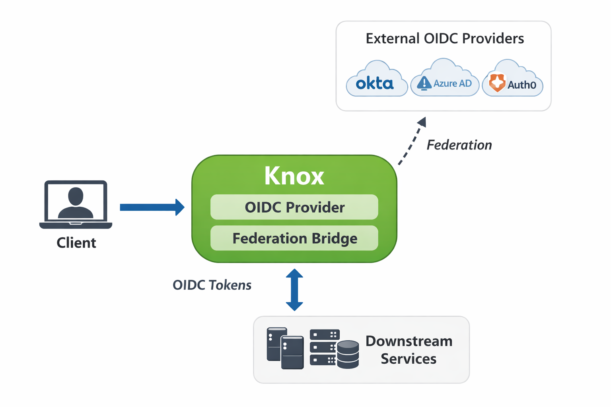

<!--
   Licensed to the Apache Software Foundation (ASF) under one or more
   contributor license agreements.  See the NOTICE file distributed with
   this work for additional information regarding copyright ownership.
   The ASF licenses this file to You under the Apache License, Version 2.0
   (the "License"); you may not use this file except in compliance with
   the License.  You may obtain a copy of the License at

       https://www.apache.org/licenses/LICENSE-2.0

   Unless required by applicable law or agreed to in writing, software
   distributed under the License is distributed on an "AS IS" BASIS,
   WITHOUT WARRANTIES OR CONDITIONS OF ANY KIND, either express or implied.
   See the License for the specific language governing permissions and
   limitations under the License.
-->

# Identity Federation (OIDC Provider)

## Overview

Historically, Apache Knox Gateway has acted as a *federation client* — it delegates
authentication to external Identity Providers (IdPs) such as CAS, SAML, OAuth 2.0, and
OpenID Connect (OIDC) providers (via pac4j). In that model Knox is strictly a relying
party and never an identity provider itself.

**KnoxIDF** turns Apache Knox into an **OAuth 2.0 / OpenID Connect Provider (OP)** in its
own right, while retaining Knox's existing federation capabilities. With KnoxIDF:

- Knox can **issue** OAuth 2.0 / OIDC tokens (access tokens and ID tokens) directly to clients.
- Knox can optionally **federate** identities and tokens from external, well-known OIDC
  Providers (e.g. Keycloak, Okta, Azure AD, Auth0), brokering the login and then re-issuing
  its own Knox-signed tokens.
- Downstream services integrate with Knox exactly as they would with any standard OIDC
  provider — they only need to trust Knox, regardless of how authentication was performed
  upstream.

This makes Knox both an **OIDC Provider** and an **OIDC federation bridge**, enabling gradual
migration to — or a hybrid of — Knox-centric and external identity architectures.

## Why KnoxIDF

Many modern architectures expect a centralized OIDC Provider that issues tokens to
downstream services. Products like Okta, Azure AD, and Keycloak are commonly used for this,
but introducing and operating a separate IdP is not always desirable — especially in
Hadoop-centric or Knox-centric deployments where Knox is already the trusted edge. KnoxIDF
closes that gap: the gateway you already run at the perimeter becomes the token authority for
the services behind it.

## Capabilities

KnoxIDF is implemented as a new Knox service (role `KNOXIDF`) that can be attached to any
topology. It provides:

| Capability | Description |
|------------|-------------|
| Standard OIDC endpoints | Discovery (`.well-known/openid-configuration`), authorization, token, userinfo, JWKS, and dynamic client registration. |
| Client Credentials flow | Machine-to-machine token issuance. |
| Authorization Code flow + PKCE | Interactive user login with PKCE (S256) for public clients and `client_secret` for confidential clients. |
| Refresh tokens | Refresh-token grant with rotation. |
| Consent | A one-time-per-(user, client) consent screen for the Authorization Code flow. |
| Federation (optional) | Broker login to one or more external OIDC Providers and re-issue Knox tokens. |
| Attribute enrichment | Hard-coded ID-token claims and pluggable user-parameter providers (e.g. LDAP attributes). |
| Persistence | Federated identity data persisted for traceability and attribute reuse (ID-token data only — no access/refresh tokens or secrets). |

## How it fits into Knox

KnoxIDF operates independently from pac4j-based inbound authentication and does not change
existing gateway authentication flows. A topology that includes the `KNOXIDF` service exposes
the OIDC endpoints; the topology's own authentication/federation providers (Shiro/LDAP,
SSOCookie, JWT, etc.) still govern how the caller is authenticated before KnoxIDF issues a
token. This keeps KnoxIDF modular and composable with the rest of Knox.

## Where to go next

- **[Getting Started](getting_started.md)** — build, deploy, register a client, and run your first flow.
- **[Endpoint Reference](endpoints.md)** — every REST endpoint KnoxIDF exposes.
- **[Configuration Reference](configuration.md)** — every configuration parameter.
- **[Security](security.md)** — client authentication, PKCE, consent, redirect-URI validation, and secret handling.
- **[Federation](federation.md)** — brokering login to external OIDC Providers.
- **[Operations](operations.md)** — high availability, rate limiting, signing-key rotation, and auditing.
- **[Integrations](integrations/polaris.md)** — worked examples of downstream services trusting KnoxIDF (e.g. replacing Keycloak in Apache Polaris).

!!! note "Relationship to KIP-18"
    KnoxIDF was originally proposed and prototyped in
    [KIP-18 — Knox as OIDC Provider](https://cwiki.apache.org/confluence/spaces/KNOX/pages/406618787/KIP-18+-+Knox+as+OIDC+Provider).
    KIP-18 describes the original design and proof-of-concept. The implementation has since
    evolved (for example, refresh-token support, hardened client authentication, and
    automatic federated-identity persistence were added after the initial proposal). Where the
    KIP and this documentation differ, **this documentation reflects the current code and is
    authoritative**; KIP-18 remains useful background on the motivation and design.
