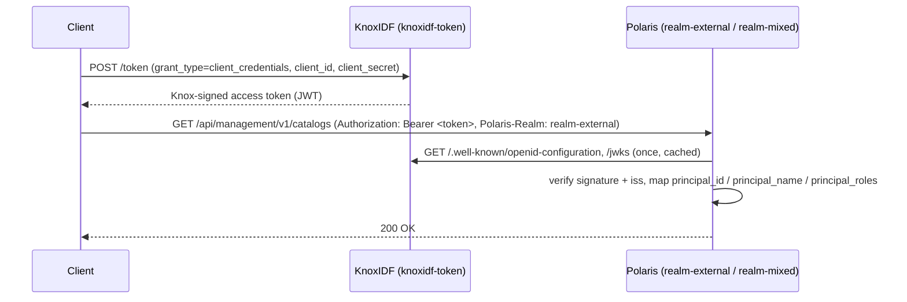

<!--
   Licensed to the Apache Software Foundation (ASF) under one or more
   contributor license agreements.  See the NOTICE file distributed with
   this work for additional information regarding copyright ownership.
   The ASF licenses this file to You under the Apache License, Version 2.0
   (the "License"); you may not use this file except in compliance with
   the License.  You may obtain a copy of the License at

       https://www.apache.org/licenses/LICENSE-2.0

   Unless required by applicable law or agreed to in writing, software
   distributed under the License is distributed on an "AS IS" BASIS,
   WITHOUT WARRANTIES OR CONDITIONS OF ANY KIND, either express or implied.
   See the License for the specific language governing permissions and
   limitations under the License.
-->

# Apache Polaris (Client Credentials)

[Apache Polaris](https://polaris.apache.org/) is a catalog for Apache Iceberg. Its
getting-started stack ships with a [Keycloak](https://www.keycloak.org/) integration that shows
Polaris trusting an **external** OpenID Connect Provider for machine-to-machine access. Because
KnoxIDF is a standard OIDC Provider, it can take Keycloak's place: Polaris trusts Knox exactly as
it would trust Keycloak, and clients obtain access tokens from Knox using the **Client
Credentials** grant.

This page walks through swapping Keycloak for KnoxIDF in Polaris' getting-started environment and
verifying end to end that Knox-issued tokens are accepted by the realms Polaris configures to
trust an external IdP.

!!! info "What this validates"
    That a downstream service configured for a Keycloak-style OIDC provider works, unchanged in
    concept, against KnoxIDF — the client credentials flow, JWKS-based signature verification, and
    claim-to-role/principal mapping.

## How it fits together

Polaris' getting-started stack defines three realms, each with a different authentication mode:

| Realm | `polaris.authentication` type | Who issues the accepted token |
|-------|-------------------------------|-------------------------------|
| `realm-internal` | `internal` | Polaris' own token endpoint (`root:s3cr3t`). A Knox token is **rejected**. |
| `realm-external` | `external` | The external OIDC Provider only — here, **KnoxIDF**. |
| `realm-mixed` | `mixed` | Either Polaris **or** the external OIDC Provider (**KnoxIDF**). |

Polaris is pointed at KnoxIDF via Quarkus OIDC. It fetches KnoxIDF's discovery document and JWKS,
validates the token signature and `iss`, and maps claims to a Polaris principal and roles:



## Prerequisites

- **Docker** — to run the Polaris getting-started stack.
- **A running Knox with KnoxIDF**, reachable from the Polaris container at
  `https://host.docker.internal:8443`. If you have not built and started Knox yet, follow
  [Getting Started](../getting_started.md) first.
- **Polaris source** — `git clone https://github.com/apache/polaris.git` (this guide assumes it is
  cloned at `~/projects/polaris`).

!!! note "host.docker.internal"
    The Polaris container reaches the Knox process running on your host through
    `host.docker.internal`. On Linux, add
    `--add-host=host.docker.internal:host-gateway` (or the Compose `extra_hosts` equivalent) if
    your Docker version does not resolve it automatically.

## 1. Deploy the `knoxidf-token` topology

For this integration you only need a **single** topology — `knoxidf-token` — fronted by Knox's
`JWTProvider`. Save the following as `$KNOX_HOME/conf/topologies/knoxidf-token.xml`:

```xml
<?xml version="1.0" encoding="utf-8"?>
<topology>
    <gateway>
      <provider>
         <role>federation</role>
         <name>JWTProvider</name>
         <enabled>true</enabled>
         <param>
            <name>knox.token.exp.server-managed</name>
            <value>true</value>
         </param>
         <param>
            <name>jwt.expected.issuer</name>
            <value>https://host.docker.internal:8443/gateway/knoxidf-sso/knoxidf, https://host.docker.internal:8443/gateway/knoxidf-token/knoxidf</value>
         </param>
         <param>
            <name>jwt.unauthenticated.path.list</name>
            <value>/knoxidf/api/v1/.well-known/openid-configuration,/knoxidf/api/v1/jwks</value>
         </param>
      </provider>
    </gateway>

    <service>
        <role>KNOXIDF</role>
       <param>
          <name>knoxidf.knox.token.ttl</name>
          <value>120000</value> <!-- 2 mins -->
       </param>
       <param>
          <name>knoxidf.knox.token.issuer</name>
          <value>https://host.docker.internal:8443/gateway/knoxidf-token/knoxidf</value>
       </param>
       <param>
          <name>knoxidf.knox.token.limit.per.user</name>
          <value>-1</value>
       </param>
      <param>
        <name>knoxidf.knox.token.hardcoded.claim.mappings</name>
        <value>principal_roles=admin;scope=openid;principal_id=0;principal_name=root</value>
      </param>
    </service>
</topology>
```

A few parameters are load-bearing for Polaris:

| Parameter | Why Polaris needs it |
|-----------|----------------------|
| `jwt.unauthenticated.path.list` | Lets Polaris reach `/.well-known/openid-configuration` and `/jwks` **without** a bearer token, so it can bootstrap discovery and signature verification. |
| `jwt.expected.issuer` | Must contain the same issuer string Knox stamps into the token (see below), so the `JWTProvider` accepts KnoxIDF's own tokens on this topology. |
| `knoxidf.knox.token.issuer` | Sets the `iss` claim to the topology's own URL. Polaris' `quarkus.oidc.auth-server-url` resolves discovery from this issuer, so the two must agree. |
| `knoxidf.knox.token.hardcoded.claim.mappings` | **Required.** Polaris resolves a principal and its roles from token claims. Without these claims Polaris rejects the token even though the signature is valid. |

!!! warning "The hard-coded claim mappings are mandatory for Polaris"
    `principal_roles=admin;scope=openid;principal_id=0;principal_name=root` injects exactly the
    claims Polaris' OIDC mapping reads:

    | Claim | Polaris config that consumes it |
    |-------|---------------------------------|
    | `principal_roles` | `quarkus.oidc.roles.role-claim-path=principal_roles` |
    | `principal_id` | `polaris.oidc.principal-mapper.id-claim-path=principal_id` |
    | `principal_name` | `polaris.oidc.principal-mapper.name-claim-path=principal_name` |
    | `scope` | Standard OAuth scope claim (`openid`). |

    `principal_id=0` / `principal_name=root` map the client onto Polaris' bootstrap `root`
    principal. Adjust these to match a real Polaris principal for anything beyond a smoke test. See
    the [Configuration Reference](../configuration.md#hard-coded-claim-mappings) for the underlying
    `knox.token.hardcoded.claim.mappings` parameter.

Knox hot-deploys the topology within a few seconds. Confirm discovery is reachable:

```bash
curl -sk https://localhost:8443/gateway/knoxidf-token/knoxidf/api/v1/.well-known/openid-configuration | jq .
```

## 2. Register a client for the Client Credentials flow

Register a confidential client and keep its `client_id` / `client_secret` — Polaris and its setup
scripts authenticate with them. (See [Getting Started §5](../getting_started.md#5-register-a-client)
for details; if your registration endpoint is not open anonymously, register through whichever
front topology authenticates you.)

```bash
curl -sk -X POST \
  https://localhost:8443/gateway/knoxidf-token/knoxidf/api/v1/client/register \
  -H 'Content-Type: application/json' \
  -d '{
        "client_name": "polaris",
        "grant_types": ["client_credentials"]
      }' | jq .
```

Confirm the credentials mint a token before wiring up Polaris:

```bash
curl -sk -X POST \
  https://localhost:8443/gateway/knoxidf-token/knoxidf/api/v1/token \
  -H 'Content-Type: application/x-www-form-urlencoded' \
  -d 'grant_type=client_credentials' \
  -d 'client_id=<client_id>' \
  -d 'client_secret=<client_secret>' | jq -r .access_token
```

Decode the resulting JWT (e.g. at [jwt.io](https://jwt.io) or with `jq`) and verify it carries
`iss`, `principal_roles`, `principal_id`, and `principal_name`.

## 3. Create the Polaris environment

Polaris' getting-started tree keeps one directory per IdP under `getting-started/`. Create a
KnoxIDF variant alongside the Keycloak one:

```bash
cd ~/projects/polaris/getting-started
cp -r keycloak polaris_knoxidf   # start from the Keycloak template
```

Then edit `polaris_knoxidf/docker-compose.yml` to point Polaris at KnoxIDF and **remove the
Keycloak service** — Knox now plays that role. The result looks like this:

```yaml
services:

  polaris:
    image: apache/polaris:latest
    ports:
      - "8181:8181"   # API
      - "8182:8182"   # management (metrics + health)
      - "5005:5005"   # optional debugger
    environment:
      POLARIS_BOOTSTRAP_CREDENTIALS: realm-internal,root,s3cr3t;realm-external,root,s3cr3t;realm-mixed,root,s3cr3t
      polaris.realm-context.realms: realm-internal,realm-external,realm-mixed
      polaris.authentication.type: internal
      polaris.authentication."realm-external".type: external
      polaris.authentication."realm-mixed".type: mixed
      quarkus.oidc.tenant-enabled: true

      # --- Trust KnoxIDF as the external OIDC Provider ---
      quarkus.oidc.auth-server-url: https://host.docker.internal:8443/gateway/knoxidf-token/knoxidf/api/v1
      quarkus.oidc.client-id: <client_id>
      quarkus.oidc.roles.role-claim-path: principal_roles
      polaris.oidc.principal-mapper.id-claim-path: principal_id
      polaris.oidc.principal-mapper.name-claim-path: principal_name

      # --- Accept Knox's self-signed dev certificate (dev only) ---
      quarkus.tls.trust-all: "true"
      quarkus.oidc.tls.tls-configuration-name: ""
      quarkus.oidc.tls.verification: none

      polaris.features."ALLOW_INSECURE_STORAGE_TYPES": "true"
      polaris.features."SUPPORTED_CATALOG_STORAGE_TYPES": "[\"FILE\",\"S3\",\"GCS\",\"AZURE\"]"
      polaris.readiness.ignore-severe-issues: "true"
    healthcheck:
      test: ["CMD", "curl", "http://localhost:8182/q/health"]
      interval: 2s
      timeout: 10s
      retries: 10
      start_period: 10s

  polaris-setup:
    image: alpine/curl
    depends_on:
      polaris:
        condition: service_healthy
    environment:
      - CLIENT_ID=root
      - CLIENT_SECRET=s3cr3t
    volumes:
      - ../assets/polaris/:/polaris
    entrypoint: "/bin/sh"
    command:
      - "-c"
      - >-
        apk add --no-cache jq &&
        chmod +x /polaris/create-catalog.sh &&
        token=$$(curl -sk -X POST -H "Content-Type: application/x-www-form-urlencoded" 'https://host.docker.internal:8443/gateway/knoxidf-token/knoxidf/api/v1/token' -d 'client_id=<client_id>' -d 'client_secret=<client_secret>' -d 'grant_type=client_credentials' | jq -r .access_token) &&
        /polaris/create-catalog.sh realm-internal &&
        /polaris/create-catalog.sh realm-external $$token &&
        /polaris/create-catalog.sh realm-mixed $$token
```

The key changes relative to the Keycloak template:

- **`quarkus.oidc.auth-server-url`** points at the `knoxidf-token` topology's OIDC base
  (`…/knoxidf/api/v1`) instead of Keycloak. This is the issuer Polaris uses for discovery, so it
  must match `knoxidf.knox.token.issuer` from the topology.
- **`quarkus.oidc.client-id`** is your registered KnoxIDF `client_id`.
- **`quarkus.oidc.roles.role-claim-path`** / **`principal-mapper.*-claim-path`** read the
  `principal_*` claims injected by the topology's hard-coded claim mappings.
- **`quarkus.tls.trust-all` / `quarkus.oidc.tls.verification: none`** let Quarkus accept Knox's
  self-signed development certificate. **Development only** — provide a real trust store in
  production.
- The **`polaris-setup`** helper fetches a KnoxIDF token via client credentials and uses it to
  create a catalog in the `realm-external` and `realm-mixed` realms (which trust Knox), while
  `realm-internal` is seeded with Polaris' own `root:s3cr3t` credentials.

!!! danger "Never commit real secrets"
    Replace `<client_id>` / `<client_secret>` with your registered values. `client_secret` is a
    credential — keep it out of version control.

## 4. Run it

```bash
cd ~/projects/polaris
docker compose -f getting-started/polaris_knoxidf/docker-compose.yml up
```

Polaris comes up on `http://localhost:8181` (management on `8182`). The `polaris-setup` container
runs once, obtains a KnoxIDF token, and creates the `quickstart_catalog` in each realm.

## 5. Verify the flow

The verification calls the Polaris management API (`/api/management/v1/catalogs`) with different
tokens and `Polaris-Realm` headers, and asserts that each combination returns the HTTP status the
realm's authentication mode dictates. The script below automates the whole matrix: it mints a
KnoxIDF token via client credentials, mints Polaris-native tokens for the `internal` and `mixed`
realms (using `root:s3cr3t` against Polaris' own `/api/catalog/v1/oauth/tokens`), then exercises
every `(token, realm)` pair.

Save it as `polaris_knoxidf_test.sh` and fill in your registered `client_id` / `client_secret`:

??? example "polaris_knoxidf_test.sh"
    ```bash
    #!/usr/bin/env bash
    set -euo pipefail

    ###############################################################################
    # CONFIG
    ###############################################################################

    POLARIS_URL="http://localhost:8181"
    KNOX_TOKEN_URL="https://localhost:8443/gateway/knoxidf-token/knoxidf/api/v1/token"

    CLIENT_ID="<client_id>"
    CLIENT_SECRET="<client_secret>"

    ###############################################################################
    # 1. OBTAIN KNOXIDF TOKEN (client credentials)
    ###############################################################################

    echo ""
    echo "=================================================================="
    echo "  OBTAINING TOKEN FROM KNOXIDF"
    echo "=================================================================="

    KNOX_TOKEN=$(curl -sk \
      -X POST "$KNOX_TOKEN_URL" \
      -H "Content-Type: application/x-www-form-urlencoded" \
      -d "client_id=$CLIENT_ID" \
      -d "client_secret=$CLIENT_SECRET" \
      -d "grant_type=client_credentials" \
      | jq -r '.access_token')

    echo "KnoxIDF token: $KNOX_TOKEN"
    echo ""

    ###############################################################################
    # 2. OBTAIN POLARIS-NATIVE TOKENS (internal + mixed realms)
    ###############################################################################

    echo ""
    echo "=================================================================="
    echo "  OBTAINING POLARIS TOKENS (Internal + Mixed)"
    echo "=================================================================="

    POLARIS_TOKEN_REALM_INTERNAL=$(curl -s "$POLARIS_URL/api/catalog/v1/oauth/tokens" \
      --user root:s3cr3t \
      -H 'Polaris-Realm: realm-internal' \
      -d 'grant_type=client_credentials' \
      -d 'scope=PRINCIPAL_ROLE:ALL' | jq -r .access_token)

    POLARIS_TOKEN_REALM_MIXED=$(curl -s "$POLARIS_URL/api/catalog/v1/oauth/tokens" \
      --user root:s3cr3t \
      -H 'Polaris-Realm: realm-mixed' \
      -d 'grant_type=client_credentials' \
      -d 'scope=PRINCIPAL_ROLE:ALL' | jq -r .access_token)

    echo "Polaris token (realm-internal): $POLARIS_TOKEN_REALM_INTERNAL"
    echo ""
    echo "Polaris token (realm-mixed)  : $POLARIS_TOKEN_REALM_MIXED"
    echo ""

    ###############################################################################
    # 3. TEST CASES
    ###############################################################################

    function test_curl() {
        local token="$1"
        local realm="$2"
        local description="$3"
        local expected="$4"   # Expected outcome: "SUCCEED" or "FAIL"

        echo ""
        echo "=================================================================="
        echo " $description"
        echo "=================================================================="

        local response status body
        response=$(curl -sk -w "%{http_code}" \
            -H "Authorization: Bearer $token" \
            -H "Polaris-Realm: $realm" \
            -H "Accept: application/json" \
            "$POLARIS_URL/api/management/v1/catalogs")

        status="${response: -3}"      # last 3 characters = HTTP code
        body="${response:0:${#response}-3}"

        local expected_code
        if [[ "$expected" == "SUCCEED" ]]; then
            expected_code=200
        else
            expected_code=401
        fi

        if [ "$status" -eq "$expected_code" ]; then
            echo "✅ PASS: Got HTTP $status as expected"
            if [ "$status" -eq 200 ]; then
                echo "Response JSON:"
                echo "$body" | jq .
            fi
        else
            echo "❌ FAIL: Got HTTP $status, expected $expected_code"
        fi
    }

    # External Knox token
    test_curl "$KNOX_TOKEN" "realm-internal" "TEST: Knox token → realm-internal (SHOULD FAIL)" FAIL
    test_curl "$KNOX_TOKEN" "realm-external" "TEST: Knox token → realm-external (SHOULD SUCCEED)" SUCCEED
    test_curl "$KNOX_TOKEN" "realm-mixed"    "TEST: Knox token → realm-mixed (SHOULD SUCCEED)" SUCCEED

    # Polaris-native tokens
    test_curl "$POLARIS_TOKEN_REALM_INTERNAL" "realm-internal" "TEST: Polaris token (internal) → realm-internal (SHOULD SUCCEED)" SUCCEED
    test_curl "$POLARIS_TOKEN_REALM_MIXED"    "realm-mixed"    "TEST: Polaris token (mixed) → realm-mixed (SHOULD SUCCEED)" SUCCEED

    # Cross-realm failure
    test_curl "$POLARIS_TOKEN_REALM_INTERNAL" "realm-mixed" "TEST: Polaris token (internal) → realm-mixed (SHOULD FAIL)" FAIL

    echo ""
    echo "=================================================================="
    echo "ALL TESTS COMPLETE"
    echo "=================================================================="
    ```

Run it once the stack is up:

```bash
chmod +x polaris_knoxidf_test.sh
./polaris_knoxidf_test.sh
```

### Expected results

The script asserts these six `(token, realm)` combinations:

| # | Token source | `Polaris-Realm` | Expected |
|---|--------------|-----------------|----------|
| 1 | KnoxIDF (client credentials) | `realm-internal` | **401** — internal realm rejects external tokens |
| 2 | KnoxIDF (client credentials) | `realm-external` | **200** — external realm trusts KnoxIDF |
| 3 | KnoxIDF (client credentials) | `realm-mixed` | **200** — mixed realm accepts KnoxIDF |
| 4 | Polaris-native (internal) | `realm-internal` | **200** |
| 5 | Polaris-native (mixed) | `realm-mixed` | **200** |
| 6 | Polaris-native (internal) | `realm-mixed` | **401** — token minted for another realm |

A sample run (token values and JSON bodies trimmed):

??? success "Sample output"
    ```text
    ==================================================================
      OBTAINING TOKEN FROM KNOXIDF
    ==================================================================
    KnoxIDF token: eyJqa3UiOiJodHRwczovL2xvY2FsaG9zdDo4NDQz...

    ==================================================================
      OBTAINING POLARIS TOKENS (Internal + Mixed)
    ==================================================================
    Polaris token (realm-internal): eyJhbGciOiJSUzI1NiIsInR5cCI6IkpXVCJ9...
    Polaris token (realm-mixed)  : eyJhbGciOiJSUzI1NiIsInR5cCI6IkpXVCJ9...

    ==================================================================
     TEST: Knox token → realm-internal (SHOULD FAIL)
    ==================================================================
    ✅ PASS: Got HTTP 401 as expected

    ==================================================================
     TEST: Knox token → realm-external (SHOULD SUCCEED)
    ==================================================================
    ✅ PASS: Got HTTP 200 as expected
    Response JSON:
    {
      "catalogs": [
        {
          "type": "INTERNAL",
          "name": "quickstart_catalog",
          "properties": { "default-base-location": "file:///var/tmp/quickstart_catalog/" },
          "storageConfigInfo": {
            "storageType": "FILE",
            "allowedLocations": [ "file:///var/tmp/quickstart_catalog/" ]
          }
        }
      ]
    }

    ==================================================================
     TEST: Knox token → realm-mixed (SHOULD SUCCEED)
    ==================================================================
    ✅ PASS: Got HTTP 200 as expected

    ==================================================================
     TEST: Polaris token (internal) → realm-internal (SHOULD SUCCEED)
    ==================================================================
    ✅ PASS: Got HTTP 200 as expected

    ==================================================================
     TEST: Polaris token (mixed) → realm-mixed (SHOULD SUCCEED)
    ==================================================================
    ✅ PASS: Got HTTP 200 as expected

    ==================================================================
     TEST: Polaris token (internal) → realm-mixed (SHOULD FAIL)
    ==================================================================
    ✅ PASS: Got HTTP 401 as expected

    ==================================================================
    ALL TESTS COMPLETE
    ==================================================================
    ```

Cases 2 and 3 are the ones that matter: a `200` from `realm-external` (and `realm-mixed`) with a
**KnoxIDF-issued** token confirms KnoxIDF has fully replaced Keycloak for the client credentials
flow — Polaris fetched discovery and JWKS from Knox, verified the signature and issuer, and mapped
the `principal_*` claims onto a Polaris principal and role. Case 1 confirms the `internal` realm
still refuses external tokens, and case 6 confirms realm isolation.

## Troubleshooting

| Symptom | Likely cause |
|---------|--------------|
| `401` from `realm-external` with a valid-looking token | `iss` in the token does not match `quarkus.oidc.auth-server-url`. Align `knoxidf.knox.token.issuer` with the URL Polaris uses. |
| Polaris logs "unable to resolve principal" / role errors | `principal_id` / `principal_name` / `principal_roles` claims missing. Check `knoxidf.knox.token.hardcoded.claim.mappings` on the topology. |
| Polaris cannot fetch discovery/JWKS (connection or `401` at startup) | Discovery/JWKS not anonymous. Ensure `jwt.unauthenticated.path.list` lists both `/.well-known/openid-configuration` and `/jwks`, and that `host.docker.internal:8443` is reachable from the container. |
| TLS handshake failures | Knox's dev certificate is not trusted. For local testing set `quarkus.tls.trust-all: "true"`; in production configure a proper trust store. |
| Token expires mid-test | `knoxidf.knox.token.ttl` is `120000` (2 min) in the sample topology. Raise it or re-request the token. |

## Next steps

- Drive an interactive browser login (Authorization Code + PKCE) instead of client credentials —
  see the [Endpoint Reference](../endpoints.md#authorization-endpoint) and
  [Security](../security.md#pkce).
- Broker Polaris logins to an upstream OIDC Provider while still issuing Knox tokens — see
  [Federation](../federation.md).
- Tune token lifetime, issuer, and claims — see the
  [Configuration Reference](../configuration.md).
