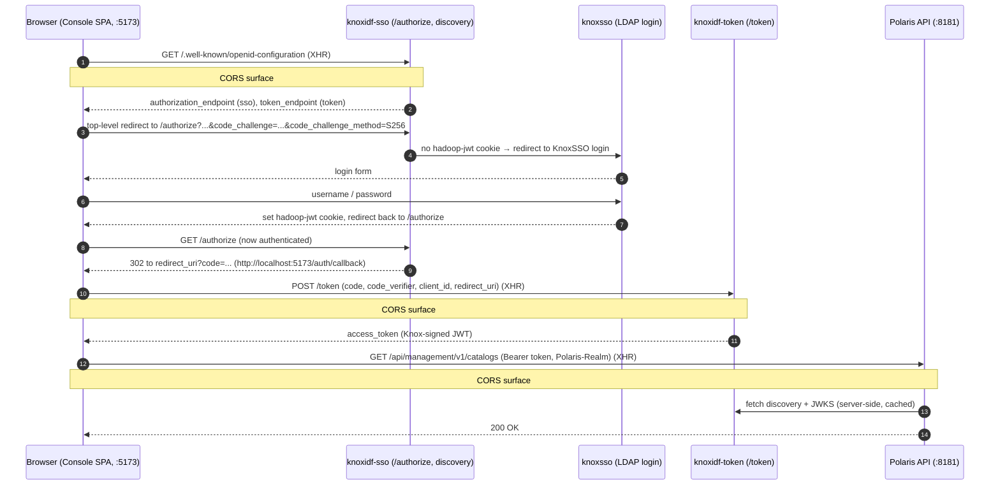
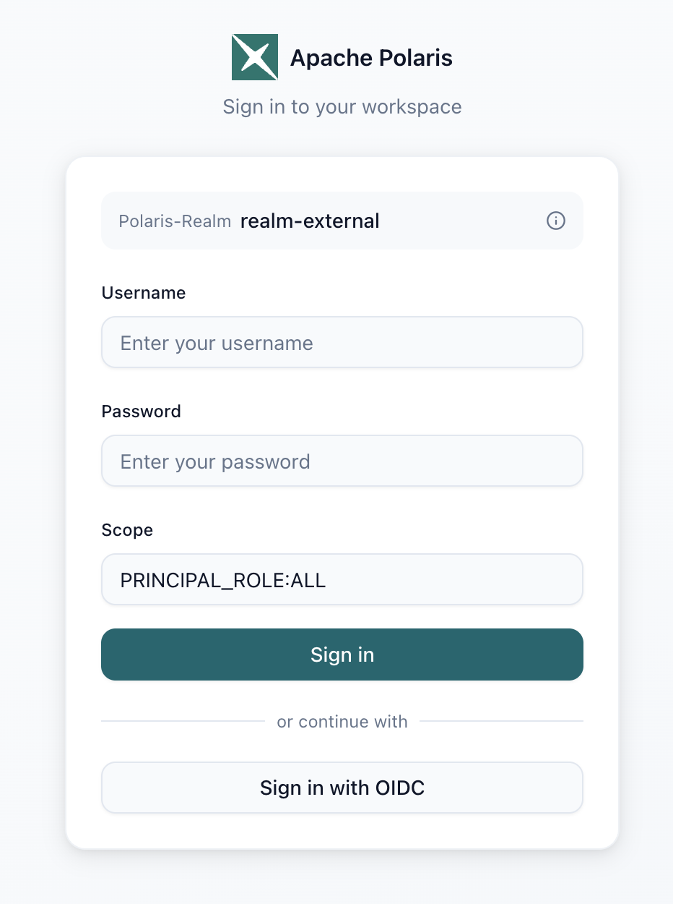
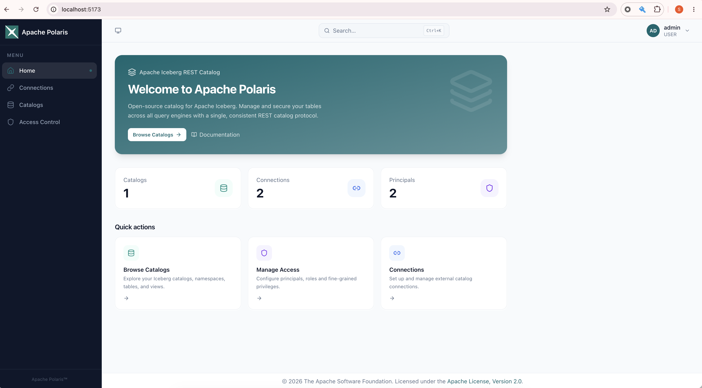

<!--
   Licensed to the Apache Software Foundation (ASF) under one or more
   contributor license agreements.  See the NOTICE file distributed with
   this work for additional information regarding copyright ownership.
   The ASF licenses this file to You under the Apache License, Version 2.0
   (the "License"); you may not use this file except in compliance with
   the License.  You may obtain a copy of the License at

       https://www.apache.org/licenses/LICENSE-2.0

   Unless required by applicable law or agreed to in writing, software
   distributed under the License is distributed on an "AS IS" BASIS,
   WITHOUT WARRANTIES OR CONDITIONS OF ANY KIND, either express or implied.
   See the License for the specific language governing permissions and
   limitations under the License.
-->

# Apache Polaris Console (Authorization Code + PKCE)

The [Apache Polaris](https://polaris.apache.org/) **Console** is a browser single-page
application (SPA) — a React/Vite app that talks to the Polaris REST API. Unlike the
[Client Credentials integration](polaris.md), which is machine-to-machine, the Console signs in a
**human**: it runs the OAuth2 **Authorization Code + PKCE** flow against KnoxIDF, obtains a
Knox-issued access token in the browser, and then calls the Polaris API with that token.

This page wires KnoxIDF up as the Console's OpenID Connect Provider end to end. It covers the two
KnoxIDF topologies involved, the KnoxSSO topology that authenticates the user, registering the
Console as a **public** (secret-less) PKCE client, the Polaris backend configuration, the
Console's `.env`, and — because this flow crosses three origins in the browser — the CORS wiring
that makes it all work.

!!! info "What this validates"
    That a browser SPA can authenticate an interactive user through KnoxIDF using Authorization
    Code + PKCE with **no client secret**, that the resulting Knox token is accepted by the
    Polaris API, and that the three cross-origin surfaces (discovery, token, and the Polaris API)
    are reachable from the SPA.

!!! note "Public client, no secret"
    A browser SPA cannot keep a secret. This flow therefore uses a **public** client
    (`token_endpoint_auth_method` = `none`) protected by **PKCE** (`S256`). There is no
    `client_secret` anywhere in the browser, the `.env`, or the token request — the proof of
    possession is the PKCE `code_verifier`.

## How it fits together

Three server-side pieces cooperate, plus the Polaris backend:

| Component | Topology | Role in this flow |
|-----------|----------|-------------------|
| **KnoxSSO** | `knoxsso` | Authenticates the human (LDAP/Shiro) and mints the `hadoop-jwt` SSO cookie. |
| **KnoxIDF front** | `knoxidf-sso` | Serves discovery, `/authorize`, and the callback. Browser-facing, protected by the SSO cookie. Issues the authorization **code**. |
| **KnoxIDF token** | `knoxidf-token` | Serves `/token`. Exchanges the code (+ PKCE verifier) for the access token. This is the `iss` Polaris trusts. |
| **Polaris** | — (Quarkus) | Trusts KnoxIDF via Quarkus OIDC; serves `/api/management` and `/api/catalog` to the Console. |

The Console fetches discovery from `knoxidf-sso`; the discovery document advertises the
`authorization_endpoint` on `knoxidf-sso` and the `token_endpoint` on `knoxidf-token` (the split
comes from `knoxidf.token.exchange.topology.name`). The user logs in once via KnoxSSO; the
`hadoop-jwt` cookie then lets `/authorize` issue a code without a second login.



!!! danger "Three CORS surfaces"
    Because the SPA and the servers are on different origins, **three** cross-origin surfaces must
    each return CORS headers. Miss any one and the browser blocks the request with a CORS error —
    even though a `curl` from the shell succeeds.

    | # | Request | Server that must send CORS |
    |---|---------|----------------------------|
    | 1 | `GET /.well-known/openid-configuration` (discovery) | `knoxidf-sso` topology |
    | 2 | `POST /token` | `knoxidf-token` topology |
    | 3 | `GET/POST /api/**` (catalogs, principals, …) | Polaris (Quarkus) |

    `/authorize` is a **top-level browser navigation**, not an XHR, so it needs **no** CORS.

## Prerequisites

- A working KnoxIDF deployment (see [Getting Started](../getting_started.md)).
- A KnoxSSO topology able to authenticate a user (this page uses the demo LDAP on
  `ldap://localhost:33389`).
- The Polaris getting-started stack from the [Client Credentials page](polaris.md) — this page
  adds the Console and the browser flow on top of it.
- The [Polaris Console](https://github.com/apache/polaris-tools) checked out and its dev server
  runnable (`npm run dev`, Vite on `http://localhost:5173`).

!!! note "Hostnames in this guide"
    Browser-facing Knox URLs use `https://localhost:8443`. The Polaris **container** reaches Knox
    at `https://host.docker.internal:8443` (the two differ only because one caller is your host
    browser and the other is a container). Whatever host you pick for the browser side, use the
    **exact same host and scheme** everywhere it appears (see the redirect-loop warning below).

## 1. KnoxSSO topology (authenticates the user)

The Console flow reuses your existing `knoxsso` topology to log the user in and mint the
`hadoop-jwt` cookie. Only one setting matters for this integration — the **issuer** — and it must
match `knoxidf-sso` exactly.

```xml
<service>
    <role>KNOXSSO</role>
    <param>
        <name>knoxsso.token.ttl</name>
        <value>86400000</value>
    </param>
    <param>
        <name>knoxsso.redirect.whitelist.regex</name>
        <value>^.*$</value>
    </param>
    <param>
        <name>knoxsso.cookie.samesite</name>
        <value>Lax</value>
    </param>
    <param>
        <!-- MUST be identical (scheme + host + port + path) to knoxidf-sso's jwt.expected.issuer -->
        <name>knoxsso.token.issuer</name>
        <value>https://localhost:8443/gateway/knoxidf-sso/knoxidf</value>
    </param>
</service>
```

!!! danger "Issuer mismatch → infinite redirect loop"
    If `knoxsso.token.issuer` and `knoxidf-sso`'s `jwt.expected.issuer` disagree — even only by
    scheme (`http` vs `https`) — the SSO cookie `knoxidf-sso` receives is rejected, so it bounces
    the browser back to KnoxSSO, which mints another cookie, and so on. Chrome shows
    `ERR_TOO_MANY_REDIRECTS`. Make the two strings **byte-for-byte identical**, and clear any
    stale `hadoop-jwt` cookie after changing them.

## 2. `knoxidf-sso` topology (discovery, `/authorize`, callback)

This browser-facing topology is protected by the `SSOCookieProvider` (so `/authorize` can rely on
the KnoxSSO login) and must serve discovery cross-origin to the SPA. Note the **CORS provider is
listed first**.

```xml
<topology>
    <gateway>
        <!-- CORS surface #1: discovery is fetched by the SPA via XHR -->
        <provider>
            <role>webappsec</role>
            <name>WebAppSec</name>
            <enabled>true</enabled>
            <param><name>cors.enabled</name><value>true</value></param>
            <param><name>cors.allowOrigin</name><value>http://localhost:5173</value></param>
            <param><name>cors.supportedMethods</name><value>GET,POST,HEAD,OPTIONS</value></param>
            <param><name>cors.supportedHeaders</name><value>*</value></param>
            <param><name>cors.exposedHeaders</name><value>*</value></param>
            <param><name>cors.supportsCredentials</name><value>false</value></param>
        </provider>

        <provider>
            <role>federation</role>
            <name>SSOCookieProvider</name>
            <enabled>true</enabled>
            <param>
                <name>sso.authentication.provider.url</name>
                <value>https://localhost:8443/gateway/knoxsso/api/v1/websso</value>
            </param>
            <param>
                <!-- MUST match knoxsso.token.issuer exactly -->
                <name>jwt.expected.issuer</name>
                <value>https://localhost:8443/gateway/knoxidf-sso/knoxidf</value>
            </param>
            <param>
                <!-- endpoints reachable before the SSO cookie exists -->
                <name>sso.unauthenticated.path.list</name>
                <value>/knoxidf/api/v1/.well-known/openid-configuration,/knoxidf/api/v1/jwks,/knoxidf/api/v1/client/register,/knoxidf/api/v1/callback,/knoxidf/api/v1/websso/federated/op</value>
            </param>
        </provider>
    </gateway>

    <service>
        <role>KNOXIDF</role>
        <param>
            <!-- /authorize issues a code on knoxidf-sso; /token lives on knoxidf-token -->
            <name>knoxidf.token.exchange.topology.name</name>
            <value>knoxidf-token</value>
        </param>
        <param>
            <name>knoxidf.knox.token.issuer</name>
            <value>https://localhost:8443/gateway/knoxidf-sso/knoxidf</value>
        </param>
        <param>
            <!-- allow the loopback redirect_uri (http://localhost:5173/...) for local dev -->
            <name>knoxidf.client.registration.anonymous.allowed</name>
            <value>true</value>
        </param>
    </service>
</topology>
```

!!! note "Federated upstream OPs are optional"
    `knoxidf-sso` can additionally federate to upstream OpenID Providers (Keycloak, Auth0, …) via
    the `websso/federated/op` path. That is orthogonal to this Console flow — see
    [Federation](../federation.md). Keep any upstream client secrets **out** of files you commit.

## 3. `knoxidf-token` topology (the `/token` endpoint)

This is the topology from the [Client Credentials page](polaris.md), with **one addition**: a CORS
provider so the SPA's `POST /token` (XHR) succeeds. The hardcoded claim mappings shape the token
into the principal/roles Polaris expects.

```xml
<topology>
    <gateway>
        <!-- CORS surface #2: /token is called by the SPA via XHR -->
        <provider>
            <role>webappsec</role>
            <name>WebAppSec</name>
            <enabled>true</enabled>
            <param><name>cors.enabled</name><value>true</value></param>
            <param><name>cors.allowOrigin</name><value>http://localhost:5173</value></param>
            <param><name>cors.supportedMethods</name><value>GET,POST,HEAD,OPTIONS</value></param>
            <param><name>cors.supportedHeaders</name><value>*</value></param>
            <param><name>cors.exposedHeaders</name><value>*</value></param>
            <param><name>cors.supportsCredentials</name><value>false</value></param>
        </provider>

        <provider>
            <role>federation</role>
            <name>JWTProvider</name>
            <enabled>true</enabled>
            <param><name>knox.token.exp.server-managed</name><value>true</value></param>
            <param>
                <name>jwt.expected.issuer</name>
                <value>https://host.docker.internal:8443/gateway/knoxidf-sso/knoxidf, https://host.docker.internal:8443/gateway/knoxidf-token/knoxidf</value>
            </param>
            <param>
                <name>jwt.unauthenticated.path.list</name>
                <value>/knoxidf/api/v1/.well-known/openid-configuration,/knoxidf/api/v1/jwks</value>
            </param>
        </provider>
    </gateway>

    <service>
        <role>KNOXIDF</role>
        <param><name>knoxidf.knox.token.ttl</name><value>120000</value></param>
        <param>
            <name>knoxidf.knox.token.issuer</name>
            <value>https://host.docker.internal:8443/gateway/knoxidf-token/knoxidf</value>
        </param>
        <param><name>knoxidf.knox.token.limit.per.user</name><value>-1</value></param>
        <param>
            <!-- shape the token into the principal/roles Polaris maps -->
            <name>knoxidf.knox.token.hardcoded.claim.mappings</name>
            <value>principal_roles=admin;scope=openid;principal_id=0;principal_name=root</value>
        </param>
    </service>
</topology>
```

!!! warning "The token issuer is what Polaris trusts"
    `knoxidf-token`'s `knoxidf.knox.token.issuer` is the `iss` baked into the access token. It
    must equal Polaris' `quarkus.oidc.auth-server-url` base (`host.docker.internal:8443`), which
    is why the browser side (`localhost`) and the Polaris side (`host.docker.internal`) differ.

## 4. Register the Console as a public PKCE client

Register a **public** client whose only redirect URI is the Console's callback. Because the
redirect URI is a **loopback** address, plain `http` is permitted (RFC 8252); a non-loopback
redirect URI would have to use `https`.

```bash
curl -sk -X POST \
  -H "Content-Type: application/x-www-form-urlencoded" \
  'https://localhost:8443/gateway/knoxidf-sso/knoxidf/api/v1/client/register' \
  -d 'redirect_uris=http://localhost:5173/auth/callback' \
  -d 'allowed_scopes=openid,profile,email,offline_access'
```

The response's `token_id` is your `client_id`. A public client has **no usable secret** — the
Console never sends one; PKCE is the client's proof of possession.

```json
{
  "token_id": "<client_id>",
  "redirect_uris": "http://localhost:5173/auth/callback",
  "allowed_scopes": "openid,profile,email,offline_access"
}
```

!!! note "Registration uses form encoding"
    `/client/register` is `application/x-www-form-urlencoded` (comma-separated `redirect_uris`),
    **not** JSON. See the [Endpoint Reference](../endpoints.md#client-registration-endpoint).

## 5. Configure Polaris (backend)

Start from the `docker-compose.yml` in the [Client Credentials page](polaris.md) — the OIDC
settings (`quarkus.oidc.auth-server-url`, `quarkus.oidc.client-id`, the `principal-mapper` and
`role-claim-path`) are unchanged. Add the **CORS** block so the Console (a different origin) can
call `/api/**`:

```yaml
    environment:
      # ... existing OIDC / realm settings from the Client Credentials guide ...

      # CORS surface #3: allow the Console SPA (Vite dev server) to call /api/**.
      # Without these, the browser blocks cross-origin /api/** requests (the preflight
      # of the Authorization and Polaris-Realm headers fails).
      quarkus.http.cors.enabled: "true"
      quarkus.http.cors.origins: "http://localhost:5173"
      quarkus.http.cors.methods: "GET,POST,PUT,DELETE,PATCH,OPTIONS,HEAD"
      quarkus.http.cors.headers: "Authorization,Content-Type,Accept,Origin,X-Requested-With,Polaris-Realm"
      quarkus.http.cors.exposed-headers: "*"
      quarkus.http.cors.access-control-max-age: "24H"
      quarkus.http.cors.access-control-allow-credentials: "false"
```

!!! danger "It is `quarkus.http.cors.enabled`, not `quarkus.http.cors`"
    On Quarkus 3.x the enable flag is **`quarkus.http.cors.enabled`**. Setting a bare
    `quarkus.http.cors: "true"` logs `Unrecognized configuration key "quarkus.http.cors" ... it
    will be ignored` and **no** `Access-Control-*` headers are emitted — the OPTIONS preflight
    returns `200` but without CORS headers, and the browser still blocks the call.

!!! warning "The `Polaris-Realm` header must be allowed"
    The Console sends a custom `Polaris-Realm` header (e.g. `realm-external`). It must appear in
    `quarkus.http.cors.headers`, or the preflight fails.

!!! note "Recreate the container after env changes"
    Environment changes only take effect on a fresh container. Re-create it, don't just restart:
    `docker compose up -d --force-recreate polaris`.

Verify the preflight actually carries CORS headers:

```bash
curl -s -i -X OPTIONS 'http://localhost:8181/api/management/v1/catalogs' \
  -H 'Origin: http://localhost:5173' \
  -H 'Access-Control-Request-Method: GET' \
  -H 'Access-Control-Request-Headers: authorization,polaris-realm'
# Expect: access-control-allow-origin: http://localhost:5173  (and allow-methods/headers)
```

### Create a principal so the Console can show the signed-in user

The Console shows the signed-in user's name in the top-right corner. It derives that name from
the token's **`sub`** claim (here `admin` — the KnoxSSO/LDAP user you log in as) and then looks it
up in Polaris' principal store via `GET /api/management/v1/principals/{sub}`. The name is shown
only if a **persisted principal with that exact name exists**; otherwise the Console falls back to
the generic label `User`.

Polaris does **not** auto-create principals for federated logins, and the getting-started stack
bootstraps only `root` — so until a matching principal exists, the header shows `User`. Create one
whose name equals the `sub`. The `polaris-setup` container already obtains a service-admin token,
so add one more step reusing it:

```yaml
        # ... after the create-catalog.sh calls, still using the same root $token ...
        curl -sk -H "Authorization: Bearer $token" \
          -H 'Content-Type: application/json' -H 'Polaris-Realm: realm-external' \
          'http://polaris:8181/api/management/v1/principals' \
          -d '{"principal":{"name":"admin"}}'
```

Then re-create the setup container: `docker compose up -d --force-recreate polaris-setup`. (Or run
the equivalent `POST /api/management/v1/principals` once by hand with any service-admin token.)

!!! note "Display only — not the authorizing identity"
    This principal exists purely so the Console can render a name. The API calls themselves are
    still authorized by the token's `principal_*` claims (the hardcoded mapping on
    `knoxidf-token`), independent of this principal. Because Polaris resolves the caller by name
    only when `principal_id` is absent or `0`, and the mapping pins `principal_name=root`, the
    caller remains `root` — the `admin` principal is looked up for display alone.

## 6. Configure the Polaris Console (`.env`)

Point the Console at the Polaris API and at KnoxIDF as its OIDC provider. Note the issuer URL uses
the **`/api/v1`** base (so discovery loads from `/api/v1/.well-known/openid-configuration`), the
redirect URI matches the one you registered, and there is **no client secret**.

```bash
# Polaris API
VITE_POLARIS_API_URL=http://localhost:8181
VITE_POLARIS_REALM=realm-external
VITE_POLARIS_PRINCIPAL_SCOPE=PRINCIPAL_ROLE:ALL

# KnoxIDF as the OIDC provider (Authorization Code + PKCE, public client)
VITE_OIDC_ISSUER_URL=https://localhost:8443/gateway/knoxidf-sso/knoxidf/api/v1
VITE_OIDC_CLIENT_ID=<client_id>
VITE_OIDC_REDIRECT_URI=http://localhost:5173/auth/callback
VITE_OIDC_SCOPE=openid profile email
```

!!! note "Discovery `issuer` vs `VITE_OIDC_ISSUER_URL`"
    `VITE_OIDC_ISSUER_URL` carries the `/api/v1` base so the SPA can find the discovery document.
    The `issuer` **inside** that document is `https://localhost:8443/gateway/knoxidf-sso/knoxidf`
    (no `/api/v1`). This is expected — the discovery base and the advertised issuer are allowed to
    differ.

## 7. Run it

1. Deploy/redeploy the three topologies (`knoxsso`, `knoxidf-sso`, `knoxidf-token`).
2. `docker compose up -d --force-recreate polaris` (and the rest of the Polaris stack).
3. Start the Console dev server: `npm run dev` (serves `http://localhost:5173`).
4. Open `http://localhost:5173` and choose **Sign in with OIDC**.

## 8. Walk through the login

The Console's sign-in card offers a direct username/password path and, for the KnoxIDF
Authorization Code flow, **Sign in with OIDC**. The realm is set to `realm-external` and the scope
to `PRINCIPAL_ROLE:ALL`.



Clicking **Sign in with OIDC** redirects the browser to `knoxidf-sso`'s `/authorize`. With no SSO
cookie yet, KnoxSSO shows its login form; after a successful LDAP login the browser returns to
`/authorize`, which issues a code and redirects to `http://localhost:5173/auth/callback?code=…`.
The Console then exchanges the code (with its PKCE `code_verifier`) at `knoxidf-token`'s `/token`,
stores the access token in memory, and lands on the dashboard.



## 9. Verify

With the token in hand, the Console calls the Polaris API. Navigating to **Catalogs** should list
the catalog created by the getting-started setup:

```bash
# The same call the Console makes (token minted via the browser flow):
curl -s 'http://localhost:8181/api/management/v1/catalogs' \
  -H "Authorization: Bearer <access_token>" \
  -H "Polaris-Realm: realm-external" | jq .
```

A populated **Catalogs** page (and a `200` from the call above) confirms the full chain:
interactive login → Knox-issued token → Polaris accepting it.

## Troubleshooting

| Symptom | Cause | Fix |
|---------|-------|-----|
| `ERR_TOO_MANY_REDIRECTS` between KnoxSSO and `/authorize` | `knoxsso.token.issuer` ≠ `knoxidf-sso` `jwt.expected.issuer` (often `http` vs `https`) | Make the two issuer strings byte-for-byte identical; clear the stale `hadoop-jwt` cookie. |
| CORS error on `/.well-known/openid-configuration` | No CORS provider on `knoxidf-sso` | Add the WebAppSec CORS provider (surface #1), origin `http://localhost:5173`. |
| CORS error on `POST /token` | No CORS provider on `knoxidf-token` | Add the WebAppSec CORS provider (surface #2). |
| CORS error on `/api/management/**` or `/api/catalog/**` | Polaris (Quarkus) sends no CORS headers | Add the `quarkus.http.cors.*` block (surface #3) and re-create the container. |
| OPTIONS returns `200` but browser still blocks; log shows `Unrecognized configuration key "quarkus.http.cors"` | Wrong Quarkus key | Use `quarkus.http.cors.enabled`, not `quarkus.http.cors`. |
| Preflight fails only when the app sends `Polaris-Realm` | Header not in the allow-list | Add `Polaris-Realm` to `quarkus.http.cors.headers`. |
| `/authorize` cannot log in | KnoxSSO cannot reach its user store | Ensure the LDAP/identity store in `knoxsso` is running and reachable (`ldap://localhost:33389` in the demo). |
| `redirect_uri` rejected at `/authorize` | Callback not registered / mismatch | Register `http://localhost:5173/auth/callback` and set the identical value in `VITE_OIDC_REDIRECT_URI`. |
| Token accepted but `403` from Polaris | Claim → role/principal mapping | Check `knoxidf.knox.token.hardcoded.claim.mappings` vs Polaris' `role-claim-path` / `principal-mapper`. |
| Header shows `User` instead of the signed-in name | No persisted Polaris principal matches the token `sub` | Create a principal named after `sub` (e.g. `admin`) — see [Create a principal so the Console can show the signed-in user](#create-a-principal-so-the-console-can-show-the-signed-in-user). |

## Next steps

- [Client Credentials integration](polaris.md) — the machine-to-machine counterpart to this flow.
- [Endpoint Reference](../endpoints.md) — `/authorize`, `/token`, discovery, and PKCE details.
- [Federation](../federation.md) — front `knoxidf-sso` with upstream OpenID Providers.
- [Security](../security.md) — dynamic client registration and hardening.
