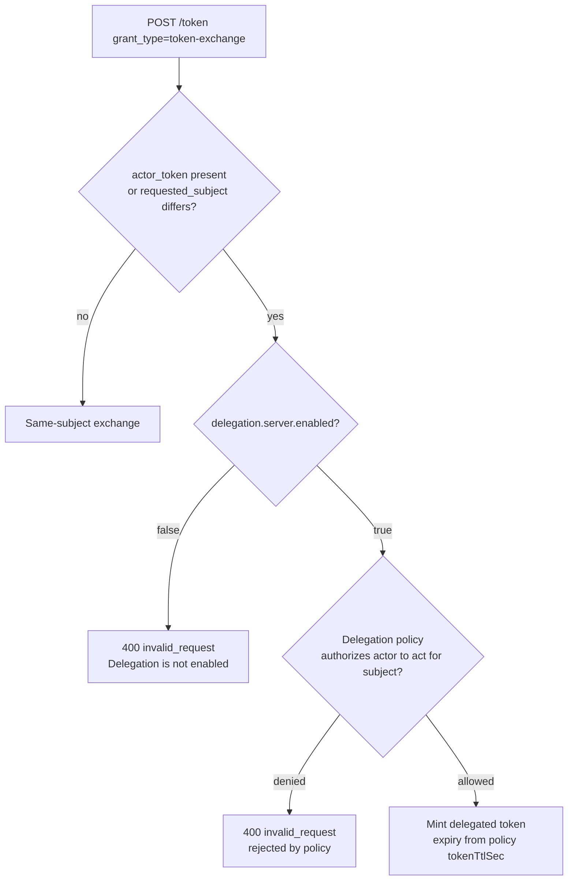

<!--
   Licensed to the Apache Software Foundation (ASF) under one or more
   contributor license agreements.  See the NOTICE file distributed with
   this work for additional information regarding copyright ownership.
   The ASF licenses this file to You under the Apache License, Version 2.0
   (the "License"); you may not use this file except in compliance with
   the License.  You may obtain a copy of the License at

       https://www.apache.org/licenses/LICENSE-2.0

   Unless required by applicable law or agreed to in writing, software
   distributed under the License is distributed on an "AS IS" BASIS,
   WITHOUT WARRANTIES OR CONDITIONS OF ANY KIND, either express or implied.
   See the License for the specific language governing permissions and
   limitations under the License.
-->

# Token Exchange & Delegation

KnoxIDF implements the [RFC 8693](https://www.rfc-editor.org/rfc/rfc8693) OAuth 2.0 **Token
Exchange** grant on its [token endpoint](endpoints.md#token-endpoint). Token exchange lets a
caller trade one JWT for another — either for the **same subject** (for example, to narrow the
audience of a token) or, when **delegation** is enabled, for a *different* subject, so a trusted
actor can obtain a token that acts **on behalf of** another identity.

Because delegation lets one identity act as another, every delegated exchange is **default-denied**
and must be authorized by an operator-defined **delegation policy**. All of the switches described
here are off by default (fail-safe): a freshly deployed topology performs no delegated exchange and
silently ignores requested audiences until you explicitly opt in.

!!! note "Two topologies"
    Token exchange runs on the **token-exchange topology** — the one fronted by a `JWTProvider` and
    named by `token.exchange.topology.name` (the sample calls it `knoxidf-token`). The provider
    parameters below are set on that `JWTProvider`. Delegation policies are managed through a
    separate administrator-only topology hosting the `KNOXIDF_ADMIN` role — see
    [Managing delegation policies](#managing-delegation-policies).

## The exchange request

An exchange is a `POST` to the token endpoint with
`grant_type=urn:ietf:params:oauth:grant-type:token-exchange`:

| Parameter | Required | Description |
|-----------|----------|-------------|
| `grant_type` | Yes | `urn:ietf:params:oauth:grant-type:token-exchange`. |
| `subject_token` | Yes | The token whose subject the exchange is *for*. |
| `subject_token_type` | Yes | `urn:ietf:params:oauth:token-type:jwt` (or its alias `urn:ietf:params:oauth:token-type:access_token`). Any other type → `invalid_request`. |
| `actor_token` | No | A token identifying the acting party in an on-behalf-of exchange. |
| `actor_token_type` | Conditional | **Required** when `actor_token` is present, and **must not** appear otherwise. Same JWT-family types as `subject_token_type`. |
| `requested_subject` | No | The identity to impersonate in a *headless* delegation exchange. Only read when `delegation.requested.subject.enabled=true`. |
| `resource` | No | Target service URI(s) for the issued token (RFC 8707). Absolute URI without a fragment, else `invalid_target`. Repeatable and comma-splittable. |
| `audience` | No | Logical target audience(s) for the issued token. Repeatable and comma-splittable. |

On success the endpoint mints a new Knox-signed JWT and returns the standard token response
extended with the RFC 8693 `issued_token_type`:

```json
{
  "access_token": "<JWT>",
  "token_id": "<UUID>",
  "token_type": "Bearer",
  "issued_token_type": "urn:ietf:params:oauth:token-type:jwt",
  "expires_in": 86400,
  "managed_token": "true"
}
```

`expires_in` is a **relative lifetime in seconds** (RFC 6749 §5.1). For a token that never expires
it is omitted entirely rather than reported as a bogus value.

## Same-subject exchange

An exchange with no `actor_token` and no differing `requested_subject` is a **same-subject**
exchange: the issued token represents the same subject as `subject_token`. No delegation policy is
consulted.

Whether a same-subject exchange may **narrow the audience** of the issued token is governed by one
provider parameter:

- **`token.exchange.same.subject.requested.audience.enabled=false` (default)** — any requested
  `resource`/`audience` is **silently dropped**. The issued token falls back to the audience
  validator's default. This fail-safe default prevents a passthrough audience validator from being
  driven to mint an arbitrarily-audienced token.
- **`token.exchange.same.subject.requested.audience.enabled=true`** — each requested audience is
  authorized against the subject token's **own `aud` claim**. If every requested value is already
  present in the subject token's `aud`, it is conveyed to the minted token; if any requested value
  is absent (including when the subject token carries no `aud` at all) the exchange is rejected with
  **HTTP 400 `invalid_target`** ("The requested audience is not authorized for this subject").

## Delegated exchange

A delegated (on-behalf-of) exchange produces a token whose subject differs from the acting party.
It comes in two shapes, and **both** require the master switch
**`delegation.server.enabled=true`** on the `JWTProvider`. While delegation is disabled, any
delegated exchange is rejected — before any policy lookup — with HTTP 400 `invalid_request`
("Delegation is not enabled for this topology").

**Actor-token (on-behalf-of).** The caller presents an `actor_token`. The actor is the
`actor_token`'s identity; the impersonated subject is the `subject_token`'s subject. Any pre-existing
`act` (actor) chain on the `subject_token` is carried forward onto the minted token.

**Headless.** The caller presents no `actor_token` but supplies a `requested_subject` that differs
from the `subject_token`'s own `sub`. Here the `subject_token`'s own identity is the actor and
`requested_subject` names the impersonated party — the shape intended for non-interactive
batch/service jobs. It additionally requires **`delegation.requested.subject.enabled=true`** (which
gates whether `requested_subject` is read at all); the value must be non-blank, at most 4096
characters, and free of control characters, else `invalid_request` ("The requested_subject value is
malformed").

Presenting **both** an `actor_token` and a `requested_subject` that differs from the subject's `sub`
is rejected with `invalid_request`.



### Requested-audience enforcement for delegated exchanges

Two independent provider parameters constrain the requested `resource`/`audience` of a *delegated*
exchange (they have no effect on same-subject exchanges):

| Parameter | Default | Effect |
|-----------|---------|--------|
| `delegation.enforce.requested.audience.required` | `false` | Require at least one distinct `resource`/`audience` value, else `invalid_request`. |
| `delegation.enforce.requested.audience.max.one` | `false` | Allow at most one distinct combined `resource`/`audience` value, else `invalid_request`. |

Enabling both yields an "exactly one audience" policy.

## Delegation policies

A delegation policy authorizes a specific **actor** to act for a set of subjects. Policies are keyed
by an `(actorAuthority, actorId)` pair that KnoxIDF derives from the actor's validated token:

| Actor kind | `actorAuthority` | `actorId` |
|------------|------------------|-----------|
| Ordinary subject | `USER` | the actor's `sub`, verbatim. |
| Kubernetes ServiceAccount (`sub` = `system:serviceaccount:<namespace>:<name>`) | `K8S_SA` | `<issuer>:<namespace>:<name>`. |

Each policy carries:

| Field | Type | Meaning |
|-------|------|---------|
| `actorAuthority`, `actorId` | string | The actor this policy authorizes (the lookup key; immutable after registration). |
| `name`, `description` | string | Optional labels. |
| `status` | string | `active` or `revoked` (defaults to `active`). |
| `canActForUsers` | string set | Explicit allow-list of subject names the actor may act for. |
| `canActForGroups` | string set | Groups whose members the actor may act for, resolved via LDAP (see below). |
| `allowHeadlessExchange` | boolean | Whether this actor may perform a headless (`requested_subject`) exchange. Default `false`. |
| `tokenTtlSec` | integer (nullable) | Per-policy lifetime for the minted token (see [Token lifetime](#token-lifetime)). |
| `resourcePolicy` | map | Optional map of allowed resource/audience → allowed scopes. |

At least one of `canActForUsers` / `canActForGroups` must be set.

### How a policy is evaluated

For a delegated exchange, KnoxIDF looks up the actor's policy and evaluates it in order:

1. **No policy** for `(actorAuthority, actorId)` → denied (`actor_not_registered`).
2. **Headless** exchange but the policy does not set `allowHeadlessExchange` → denied
   (`headless_not_allowed`).
3. The impersonated subject is in **`canActForUsers`** → authorized.
4. Otherwise, if **`canActForGroups`** is set, the subject's LDAP group membership is resolved and
   intersected with it; a match authorizes, no match is denied (`subject_not_allowed`).

!!! warning "Denials are deliberately generic"
    Whatever the specific reason, a policy denial always returns the single response
    **HTTP 400 `invalid_request`** ("The token exchange request is rejected by policy"). The precise
    reason (`actor_not_registered`, `headless_not_allowed`, `subject_not_allowed`, …) is written
    only to the [audit log](operations.md#auditing), never leaked to the caller.

!!! danger "Group rules require the LDAP service"
    Evaluating a `canActForGroups` rule requires Knox's LDAP service to resolve the subject's group
    membership. If the LDAP service is disabled, absent, or unreachable, the exchange fails with
    **HTTP 500 `server_error`** — distinct from a policy denial — directing the operator to enable
    and reach LDAP. Ensure the LDAP service is configured wherever group-based policies are used.

### Token lifetime

For a **delegated** exchange, the minted token's expiry is taken from the policy's `tokenTtlSec`
(or, when the policy leaves it unset, the gateway default
`gateway.delegation.service.token.ttl.sec`, default 3600 s). This policy-resolved TTL is trusted
server-side state, so it **deliberately bypasses** the topology `knox.token.ttl` upper bound and any
client-supplied `lifespan` clamp — this is how longer-lived headless/batch tokens are granted. It is
not unbounded: at policy-authoring time `tokenTtlSec` must fall within
`[knox.delegation.min.token.ttl.sec, knox.delegation.max.token.ttl.sec]` (defaults 60 s – 86400 s).
Same-subject exchanges are unaffected and continue to use the topology `knox.token.ttl`.

### Actor-chain depth

Each on-behalf-of hop adds the actor to the token's `act` chain. To bound how deeply exchanges can
be nested, the KNOXTOKEN service enforces **`delegation.max.actor.chain.depth`** (default `3`) when
it mints the token: if adding the current actor would make the chain exceed the maximum, the
exchange is rejected with HTTP 400 `invalid_request` ("The resulting actor chain depth (N) would
exceed the configured maximum of M."). A non-numeric or non-positive configured value is ignored and
the default of 3 applies (the check is never disabled). This applies only when KNOXTOKEN's delegated
authentication (`knox.token.enable.delegated.auth`) is enabled.

## Kubernetes ServiceAccount subjects

An externally-issued JWT — such as a Kubernetes projected **ServiceAccount** token — can be used as
the `subject_token` or `actor_token`, provided its issuer is registered in the
[trusted OIDC issuer registry](federation.md#trusted-issuer-registry). Such a token is validated on
its own `exp` claim (it carries no Knox-managed token id), and when it acts as the delegation actor
it is tagged with the `K8S_SA` authority described above. An unregistered issuer is rejected with
HTTP 401 `invalid_request` (no JWKS is fetched); an expired token is rejected with HTTP 401 ("Token
has expired"). See the [k8s ServiceAccount registration](federation.md#trusted-issuer-registry) and
[Security → Trusted issuer registry](security.md#trusted-issuer-registry) for the HTTPS/JWKS
requirements.

## Managing delegation policies

Delegation policies are created and maintained through the
[Delegation Policies admin API](endpoints.md#delegation-policies-admin) (`knoxidf/admin/v1/delegation-policies`),
served by the `KNOXIDF_ADMIN` role on an administrator-restricted topology. It supports registering
(`POST`), upserting by actor identity (`PUT`), listing/reading (`GET`), replacing (`PUT /{id}`), and
deleting (`DELETE /{id}`) policies. The persistence backend follows the same H2-by-default / JDBC
model as the rest of KnoxIDF — see [Operations → Backend selection](operations.md#backend-selection).

## Configuration summary

| Parameter | Where set | Default |
|-----------|-----------|---------|
| `delegation.server.enabled` | token-exchange `JWTProvider` | `false` |
| `delegation.requested.subject.enabled` | token-exchange `JWTProvider` | `false` |
| `delegation.enforce.requested.audience.required` | token-exchange `JWTProvider` | `false` |
| `delegation.enforce.requested.audience.max.one` | token-exchange `JWTProvider` | `false` |
| `token.exchange.same.subject.requested.audience.enabled` | token-exchange `JWTProvider` | `false` |
| `delegation.max.actor.chain.depth` | `KNOXTOKEN` service | `3` |
| `knox.delegation.min.token.ttl.sec` | `KNOXIDF_ADMIN` topology (delegation-policies resource) | `60` |
| `knox.delegation.max.token.ttl.sec` | `KNOXIDF_ADMIN` topology (delegation-policies resource) | `86400` |
| `gateway.delegation.service.token.ttl.sec` | `gateway-site.xml` | `3600` |
| `gateway.delegation.service.list.max.total` | `gateway-site.xml` | `10000` |
| `gateway.delegation.service.list.max.per.authority` | `gateway-site.xml` | `10000` |

See the [Configuration Reference](configuration.md#token-exchange-and-delegation) for descriptions
of each parameter.

## Examples

All examples target the token-exchange topology's token endpoint. Read the endpoint URL from
[discovery](endpoints.md#discovery-endpoint) rather than hard-coding it.

**Same-subject exchange** (narrow the audience — requires
`token.exchange.same.subject.requested.audience.enabled=true`, and `analytics` must already be in
the subject token's `aud`):

```bash
curl -sk -X POST \
  https://knox:8443/gateway/knoxidf-token/knoxidf/api/v1/token \
  -H 'Content-Type: application/x-www-form-urlencoded' \
  --data-urlencode 'grant_type=urn:ietf:params:oauth:grant-type:token-exchange' \
  --data-urlencode 'subject_token=<subject-JWT>' \
  --data-urlencode 'subject_token_type=urn:ietf:params:oauth:token-type:jwt' \
  --data-urlencode 'audience=analytics' | jq .
```

**Delegated (on-behalf-of) exchange** with an actor token (requires
`delegation.server.enabled=true` and a policy authorizing the actor to act for the subject):

```bash
curl -sk -X POST \
  https://knox:8443/gateway/knoxidf-token/knoxidf/api/v1/token \
  -H 'Content-Type: application/x-www-form-urlencoded' \
  --data-urlencode 'grant_type=urn:ietf:params:oauth:grant-type:token-exchange' \
  --data-urlencode 'subject_token=<subject-JWT>' \
  --data-urlencode 'subject_token_type=urn:ietf:params:oauth:token-type:jwt' \
  --data-urlencode 'actor_token=<actor-JWT>' \
  --data-urlencode 'actor_token_type=urn:ietf:params:oauth:token-type:jwt' | jq .
```

**Headless delegation** (requires `delegation.server.enabled=true`,
`delegation.requested.subject.enabled=true`, and a policy with `allowHeadlessExchange` set):

```bash
curl -sk -X POST \
  https://knox:8443/gateway/knoxidf-token/knoxidf/api/v1/token \
  -H 'Content-Type: application/x-www-form-urlencoded' \
  --data-urlencode 'grant_type=urn:ietf:params:oauth:grant-type:token-exchange' \
  --data-urlencode 'subject_token=<service-account-JWT>' \
  --data-urlencode 'subject_token_type=urn:ietf:params:oauth:token-type:jwt' \
  --data-urlencode 'requested_subject=analyst1' | jq .
```

## See also

- [Endpoint Reference → Token endpoint](endpoints.md#token-endpoint) and
  [Delegation Policies admin API](endpoints.md#delegation-policies-admin).
- [Configuration Reference → Token exchange and delegation](configuration.md#token-exchange-and-delegation).
- [Security → Delegation authorization](security.md#delegation-authorization).
- [Operations → Delegation policies](operations.md#delegation-policies) and
  [Auditing](operations.md#auditing).
